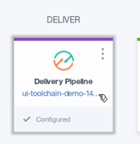
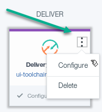

# Lab 2: Build and deploy to dev space

## Objective
This lab will build the all three microservices and deploy them to the Development space.

**Tasks**:
- Task 1: Explore the Microservices toolchain
- Task 2: Examine the build pipelines

## Task 1: Explore the Microservices toolchain

1. IBM Bluemix created the Continuous Delivery Toolchain based on the Microservices template.  At the top you see the pieces of the [Bluemix Garage Method](https://www.ibm.com/devops/method/) and where each tool integration fits.
  

2. **Think** is where the [GitHub](https://github.com/) Issues database is listed.  Click on the **ui-toolchain-demo** link (or right-mouse button click and select **Open Link in New Tab**, then select the new tab to save time later on).  
  

3. This displays the **GitHub Issues** page.  Issues are used to track todos, bugs, feature requests, and more.  Each GitHub repository (_repo_ for short) can include issues.  The Microservices template we used only included issues for the UI repo.
  
  Return to the Microservices toolchain by either clicking on the **Go back one page** arrow on the browser or, if you clicked the right-mouse button to open a new tab, close the GitHub Issues page. (Note that the remainder of these lab instructions will not go into this level of detail on opening and closing pages and tabs - pick the method that is best for you.)

4. **Code** is where [GitHub](https://github.com/) code repos, [Sauce Labs](https://saucelabs.com/) and Eclipse Orion Web IDE are integrated. Clicking on one of the three repos will display the respective (cloned) repo

  

  while clicking on the **Eclipse Orion Web IDE** will display the Web editor.  We do not have a Sauce Labs account, so we really don't need the Sauce Labs integration.  We will leave it alone for now.
 5. **Deliver** is where the code gets built, tested and deployed through the integrations of build pipelines, one per microservice. We explore build pipelines later.
 6. **Manage** is where the intergrations to management tools, such as [Pager Duty](https://www.pagerduty.com/), get added.
 7. **Learn** is where the integrations to tools helping to drive application insight, such as [DevOps Insights](https://console.ng.bluemix.net/catalog/services/devops-insights/), get added.
 8. **Culture** is where the integrations to teams collaborate more effectively are integrated, such as [Slack](http://slack.com/).

## Task 2: Examine the build pipelines

1. Clicking on one of the GitHub repo links or the **Configured** link will display the respective GitHub repo.
  

2. You can either click on the three vertical dots on the upper-right of the _ui-toolchain-demo_ Delivery Pipeline tile to display **Action** and then click on **Configure**

  

  **or** click on the circle in the center of the _ui-toolchain-demo_ Delivery Pipeline tile

  

  to display the delivery pipeline.

  
3.
