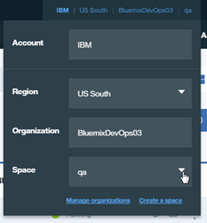

## Updates to 3478-Creating Open Toolchains for IBM Bluemix
### lab-0-getting-setup
1. Page 2 of 6 in lab
   - Instructions say **DevOpsLabs**, screen shot shows **DevOpsLab**. Organization name must be unique in Bluemix. Use one of the suggested defaults, such as your Bluemix ID or eMail address and adjust accordingly throughout.

### lab-1-read-template-paper
1. Page 1 of 5 in lab, Title should be **Lab 1**.

### lab-2-create-order-toolchain-using-pre-built-template
1. Page 1 of 16 in lab, adjust org name.
1. Page 3 of 16 in lab, adjust org name.
1. Page 5 of 16 in lab, adjust org name.
1. Page 10 of 16 in lab, adjust org name.
1. Page 14/15 of 16 in lab, screenshot for step 24 is incorrect.  Should be:

  

### lab-3-create-catalog-toolchain-by-hand
1. Page 1 of 16 in lab, adjust org name.
2. Page 11 of 16, step 17, _Deploy_ and _Functional Tests_ are jobs.

### lab-4-create-ui-toolchain-from-deployed-application
1. Page 2 of 8, step 3, adjust org name.
2. Page 4 of 8, step 5
   - If the _prod_ space is not displayed in the upper right hand corner, click the upper-right hand corner account settings and select **prod** as the _Space_.
   
2. Page 6 of 8, step 4, click **Begin Import** to start the import.
2. Page 6 of 8, new step 5
   - Close the GitHub browser tab.
   - Close the Bluemix application dashboard browser tab.
   - On the Bluemix _Create a Toolchain_ page, click the blue arrow to the left of _Toolchains_ to return to the Toolchains.
3. Page 7 of 8, step 1
   - On the Bluemix _Create a Toolchain_ page, click the blue arrow to the left of _Toolchains_ to return to the Toolchains.
   - Click the just created Toolchain _(prod-ui-toolchain-lab-timestamp)_.

### lab-5-integrate-slack-and-pagerduty
1. Page 3 of 12, step 1
   - You may have to click on the blue left arrows to display the Toolchains page
2. Page 3 of 12, step 2
   - Click _simple-order-toolchain-timestamp_.
