# Integrate Slack and PagerDuty

## Objective

Bluemix DevOps services include toolchains working together to support your development and deployment tasks. The integrations across a toolchain help ease the workflows between the tools so they work in synergy.  This lab demonstrates how to set-up and use some of the Bluemix toolchains with a variety of industry tools such as GitHub, Slack and PagerDuty to make your move to DevOps easier.  **Note:** Toolchains are currently available in the US South region only and the instructions in this lab are written for the US South region.

This lab uses the simple toolchain for the Orders API microservice.

### Teaming

Software development is a team activity.  The lab scenario also shows how Bluemix Continuous Delivery tool integrations can be used to alerts teams when activities occur (such as builds or deployments) as well as when critical incidents happen (such as a build failing or an application outage).

- Slack is configured to alert the team when activities occur
- PagerDuty is configured to alert the team about critical incidents

## Tasks
- [Task 1: Integrate Slack into Toolchain](#task-4-integrate-slack-into-toolchain)
- [Task 2: Test Slack Integration](#task-5-test-slack-integration)
- [Task 3: Integrate PagerDuty into Toolchain](#task-6-integrate-pagerduty-into-toolchain)
- [Task 4: Break the application build](#task-7-break-the-application-build)
- [Task 5: Fix application](#task-8-fix-application)

## Task 1: Integrate Slack into Toolchain

The visual display of the Delivery Pipeline is great if you want to watch it.  But if you don't want to watch or if you did not even start the build, how do you get notified of events that you are interested in?  One way is Slack.  Slack provides real-time messaging for team communications. You can integrate Slack with your Bluemix DevOps Services project so that notifications about build results from your Delivery Pipeline are posted on a Slack channel.

1. If you are not on the Toolchains page (if you don't see a button called _Create a Toolchain_), cick on the **Bluemix menu bar** in the upper left corner.

and click on **Services** then **DevOps**.
2. Click _simple-order-toolchain-timestamp_.
1. On the <b>simple-order-toolchain-<i>timestamp</i></b> Toolchain page, click **Add a Tool**.
2. Select **Slack**
3. On the Slack Configuration page:
   - Enter the following all as one string as the Slack webhook. This is also available for copying and pasting at:
   [http://ibm.biz/SlackWebHook](http://ibm.biz/SlackWebHook).
 
  **https://hooks.slack.com/services/**
 
  **T2SEPHTRB/B3XPS9JMV/CiJnw2Jg98WXYXXJ1tDMXMbK**
 
   - Enter **#interconnect_devops** as the Slack channel.
   - Enter **BluemixDevOpsLab** as the Slack team name.
  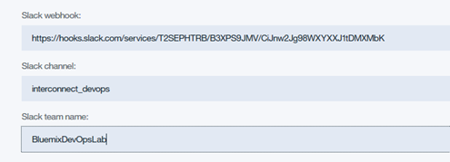

4. Click **Create Integration**
5. The integration with Slack is added.

6. Switch to the browser tab that has Slack open.  Slack notifies us that the integration was added.
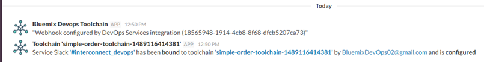

## Task 2: Test Slack Integration

Looking at the _interconnect_devops_ Slack channel, we see that other team members have been busy.  Let's see what happens when we initiate a build.

1. Switch to the browser tab displaying the Bluemix console. It should be displaying the <b>simple-order-toolchain-<i>timestamp</i></b> Toolchain page.  If not, click on the Bluemix menu bar in the upper left corner, click on Services then DevOps.  Click on Toolchains.  Then click on <b>simple-order-toolchain-<i>timestamp</i></b>.
2. Click on the **Delivery Pipeline** tile for the orders-api-toolchain-demo Delivery Pipeline.

3. Start an application build by clicking on the _BUILD_ stage **Run Stage** icon.

4. Switching to the Slack browser tab, the Slack bluemixdevopslab channel displays the progress of this activity.
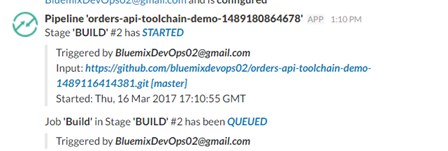

5. And the completion.
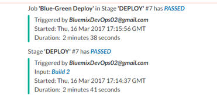
6. Through the Bluemix Continuous Delivery integration with Slack, teams get notified of events in the Delivery Pipeline.
7. Switch to the browser tab displaying the Bluemix console.  Click the blue arrow in the upper left hand corner to return to the Toolchain.

## Task 6: Integrate PagerDuty into Toolchain

As a developer or operations person, you may want to be notified of the status of critical incidents.  One way to be alerted  is to integrate third-party tools such as [PagerDuty](https://www.pagerduty.com/).  IBM Bluemix has made it easy to add PagerDuty integration into a Toolchain so the teams such as development or operations are notified of the status of deployments.

**Note:** The PagerDuty integration feature is not created by, affiliated with, or supported by PagerDuty, Inc.

1. On the <b>simple-order-toolchain-<i>timestamp</i></b> Toolchain page, click **Add a Tool**.
2. Select **PagerDuty**
3. On the PagerDuty Configuration page:
   - Enter zfuzadTuRc-z2rzbyq9K as the API access key
   - Enter _devopslab_ as the PagerDuty service name
   - Enter an email address you can access.  Leave the phone number blank.  PagerDuty has a place for you to enter your phone number if you want to receive text messages or receive phone calls.

4. Click **Create Integration**
  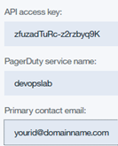
5. The integration is added.
  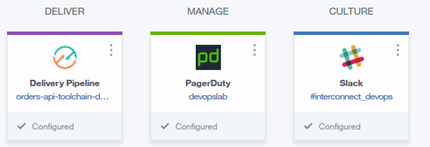
6. If you want to see what PagerDuty sends, you need to access the eMail account you specified to accept the PagerDuty invitation.
  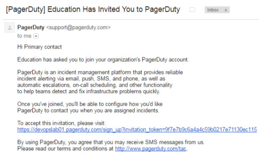

7. If you click the link to accept the invitation, you will need to create a PagerDuty account associated with the eMail you specified.  The lab has screenshots if you would prefer to not get the eMails.  You can also enter your phone information into your PagerDuty account.  If you do this, you will get text messages and/or phone calls, perhaps a lot, depending on where you entered your phone number.  Normal messaging rates apply.
  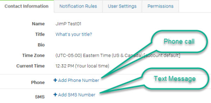

  The list of countries PagerDuty supports is at: [PagerDuty Country Support](https://support.pagerduty.com/hc/en-us/articles/202828860-Countries-PagerDuty-supports-for-SMS-and-phone-call-notifications)

## Task 3: Break the application build

Let's see what happens when the application build is broken.

1. On the <b>simple-order-toolchain-<i>timestamp</i></b> Toolchain page, click the **Eclipse Orion Web IDE** tile.
2. In the file directory, click manifest.yml to open the file.
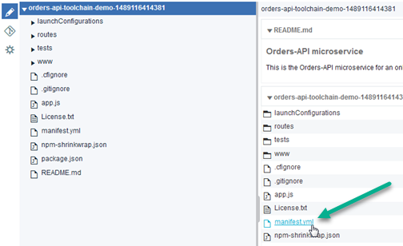
3. Update the value for memory to 96G. This setting intentionally increases your memory to exceed the quota for your org. Your changes are automatically saved.
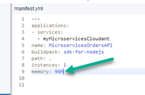
4. From the Eclipse Orion Web IDE menu, click the **Git** icon.
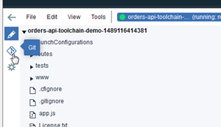
5. Enter a relevant comment and click **Commit** to push the changes in the local master branch.
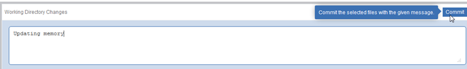
6. Click **Push** to put the changes into GitHub.
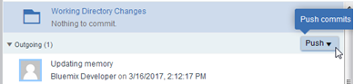
7. Your changes are automatically built and deployed in the pipeline.
8. Click the blue arrow in the upper left hand corner to return to the Toolchain.
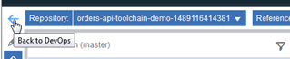
9. Click the tile for the _order-api-toolchain-lab_ Delivery Pipeline. Our change caused the deployment to fail.
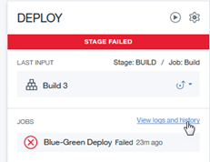
1. If you accepted the PagerDuty invitation and are logged into PagerDuty, the Incidents pages shows a triggered incident:
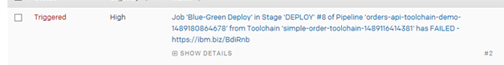
2. If you accepted the PagerDuty invitation and are logged into PagerDuty, the eMail account registered with PagerDuty get alerted.
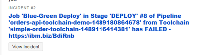
3. If you added a mobile phone number to your PagerDuty account, that phone will receive an alert and/or phone message.
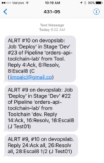
3. Switch to the Slack browser tab, Slack also notifies the team about the Deployment failure.
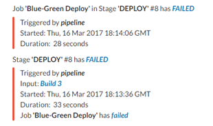
4. In Slack, there are a few links to go to the Stage, Job Input or Job. Click the **Failed** link for the Blue/Green Deploy job.
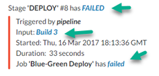
0. Looking at the _Blue/Green Deploy_ Job log (and scrolling down), we can see why it failed.
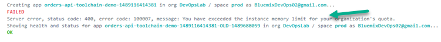
Return to the Toolchain by clicking on the vertical ellipsis on the upper right of the Bluemix console page and selecting **View Toolchain**.
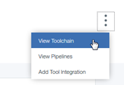

## Task 4: Fix application

Now to fix the application.
1. On the <b>simple-order-toolchain-<i>timestamp</i></b> Toolchain, click the **Eclipse Orion Web IDE** tile.
2. In the file directory, click manifest.yml to open the file.
3. Update the value for memory to 96M.
4. Now to Commit and Push the changes.  From the Eclipse Orion Web IDE menu, click the **Git** icon.
5. Click **Commit** to put the changes in the local master branch (enter a relevant Commit comment).
6. Click **Push**. Your changes are automatically built and deployed in the pipeline.
7. Return to Toolchain page and click the Delivery Pipeline tile to watch the stages run in response to your code changes.
8. You could also display the Slack browser tab to display the Delivery Pipeline progress.
8. The deploy is successful and all the downstream stages run afterwards.
9. The Delivery Pipeline shows the Git URL and Git commit link.  Click the Git commit link to show the changes that were committed that caused the Delivery Pipeline to execute.
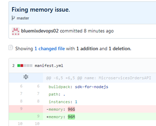
