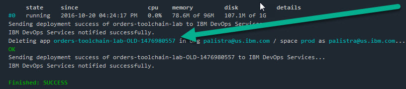

# Lab 1: Set-up Toolchain for Order

## Objective
This lab creates and configures the Toolchain for the Order application.

**Tasks**:
- [Task 1: Log into IBM Bluemix](#task-1-log-into-ibm-bluemix)
- [Task 2: Create Toolchain](#task-2-create-toolchain)
- [Task 3: Add and Configure GitHub Integration for Order](#task-3-add-and-configure-github-integration-for-order)
- [Task 4: Add Order Delivery Pipeline](#task-4-add-order-delivery-pipeline)
- [Task 5: Configure Order Delivery Pipeline](#task-4-configure-order-delivery-pipeline)

## Task 1: Log into IBM Bluemix
1. If you are not already logged into IBM Bluemix, log into IBM Bluemix.

## Task 2: Create Toolchain
  1. Click on **DevOps**.

  
  2. Click on **Toolchains**.

  
  3. Click on the **+** plus icon on the right side of the screen.

  
  4. Click on **Build your own toolchain**.

  
  5. Under 'Toolchain Settings', enter the name "devops-toolchain-lab" and click **Create**.

  

  Your Toolchain is created and you are redirected to the Toolchain panel.

## Task 3: Add and Configure GitHub Integration for Order
The code for the Order microservice already exists in a GitHub repository (https://github.com/open-toolchain/Microservices_OrdersAPI).  We will clone this repository and link to the clone.

  1. Click on the **+** plus icon on the right side of the screen to add a Tool Integration.
  2. Click on **GitHub** to add integration with GitHub to the Toolchain.

  

<ul>
<li>Select 'Clone' as the Repository type.
<li>Enter "https://github.com/<i>githubuserid</i>/orders-api-toolchain-lab.git" for the New Repository Name.
 where <i>githubuserid</i> is your GitHub userid.
<li>Enter "https://github.com/open-toolchain/Microservices_OrdersAPI" for the Source repository URL.
<li>Ensure the 'Enable GitHub Issues' checkbox is selected.
</ul>

<ul>     
<li>Click <b>Create Integration</b>.
</ul>

  The devops-toolchain-lab tool integrations is displayed.

  

## Task 4: Add Order Delivery Pipeline
Now that you have a Git repository clone of the code, we will add a Delivery Pipeline to deploy it and test it.

  1. Click on the **+** plus icon on the right side of the screen to add a Tool Integration.
  2. Click on **Delivery Pipeline** to create a new Delivery Pipeline (we will add tool integrations to this).
  3. Under 'Pipeline name:', enter "orders-toolchain-lab" and select the 'Show apps in the VIEW APP menu' checkbox.

  
  4. Click **Create Integration**.
  5. The devops-toolchain-lab delivery pipeline is displayed.

    

## Task 5: Configure Order Delivery Pipeline

<ol compact>
<li>Now to configure the orders-toolchain-lab delivery pipeline. Four stages will be added: Build, Dev, Test and Prod.
<ul compact>
<li>The <b>Build</b> stage has one job, performing the initial build of the code from the GitHub Repository.
<li>The <b>Dev</b> stage has one job, taking the output from the Build stage and deploying on Bluemix into the <i>dev</i> space.
<li>The <b>Test</b> stage has two jobs, taking the output from the Dev  stage and deploying on Bluemix into the <i>qa</i> space, then performing automated tests.
<li>The <b>Prod</b> stage has one job, taking the output from the Test stage and deploying on Bluemix into the <i>prod</i> space.  This stage will also check to see there is an earlier instance of this application running and if it is, keep it around in case the deploy of the new version of the app has problems.  If the new version deploys successfully, the old version is deleted.  If not, the new version is deleted and the old version continues to run.
</ul>

Click on the <b>Delivery Pipeline</b> tile.
 

<li>Add the <b>Build</b> stage and jobs.
<ol>
    <li>Click on <b>ADD STAGE</b>.
    <li>On the <b>INPUT</b> tab, enter "Build" for Stage Name. Note that:
    <ul compact>
    <li>'Input Type' is set to a SCM Repository, in this case, Git.
    <li>'Git Repository' is set to the name of the Git Repository we just cloned.
    <li>'Git URL' is set to the URL of the Git Repository we just cloned.
    <li>'Branch' is set to "Master".
    <li>'Stage Trigger' is set to "Run jobs whenever a change is pushed to Git", resulting in the Build stage running continuously when Git is updated.
     
    
    </ul>
    <li>Click the <b>Jobs</b> tab.
    <li>Click <b>ADD JOB</b>.
    <li>Click the <b>+</b> and select <b>Build</b> for the JOB TYPE.
     
    
    <li>On the Job configuration panel, note that:
    <ul compact>
    <li>'Builder Type' is set to "Simple" (other options are available on the pull-down).
    <li>'Run Conditions' is set to "Stop running this stage if this job fails" to prevent any other jobs in this stage from running and to make the stage failed is this Job fails.
     
    
    </ul>
    <li>Click <b>Save</b> to save the <b>Build</b> stage.
    <li>The <b>Delivery Pipeline</b> displays the <b>Build</b> stage.  This stage has not been run. Click on the <b>Run Stage</b> icon to run the build.
     
    
    
The JOBS section shows the Build was successful.
     
    
    
The <b>Build</b> stage has been successfully added and executed.
</ol>
<li>Add the <b>Dev</b> stage and jobs (remember, just one job, deploying to the <i>dev</i> space).
<ol compact>
    <li>Click on <b>ADD STAGE</b>.
    <li>On the <b>INPUT</b> tab, enter "Dev" for Stage Name. Note that:
    <ul compact>
    <li>'Input Type' is set to Build Artifacts (from the <b>Build</b> stage).
    <li>'Stage' and 'Job' are both 'Build'.
    <li>'Stage Trigger' is set to "Run jobs when the previous stage is completed", resulting in the Dev stage running when the <b>Build</b> stage successfully completes.
    </ul>
    <li>Click the <b>Jobs</b> tab.
    <li>Click <b>ADD JOB</b>.
    <li>Click the <b>+</b> and select <b>Deploy</b> for the JOB TYPE.
    <li>On the Job configuration panel, note that:
    <ul compact>
    <li>'Deployer Type' is set to "Cloud Foundry" (other options are available on the pull-down).
    <li>'Target' is set to "US South - https://api.ng/bluemix.net" as this is where the code will be deployed.
    <li>'Space' is set to "dev" (or Create a new space called <b>dev</b> if not on the dropdown).
    <li>Type the following into the "Deploy Script" section. This will create and deploy the cloudantNoSQLDB service:
    <code>cf create-service cloudantNoSQLDB Shared myMicroservicesCloudant</code>
    then deploy the application:
    <code>cf push "${CF_APP_NAME}"</code>.
    <pre>    
        #!/bin/bash
        cf create-service cloudantNoSQLDB Shared myMicroservicesCloudant
        # Push app
        export CF_APP_NAME="dev-$CF_APP"
        cf push "${CF_APP_NAME}"
        echo "Pushed App Name: ${CF_APP_NAME}."
        # View logs
        #cf logs "${CF_APP_NAME}" --recent
    </pre>    
    <li>'Run Conditions' is set to "Stop running this stage if this job fails" to prevent any other jobs in this stage from running and to make the stage failed is this Job fails.
     
    
    </ul>
    <li>The bash script just entered into the Deploy Script references the <i>CF_APP_NAME</i> environment variable ($CF_APP is provided by default).  CF_APP_NAME needs to be added to the environment variables.
    <li>Click the <b>ENVIRONMENT PROPERTIES</b> tab.
    <li>Click <b>ADD PROPERTY</b> and select <b>Text Property</b>.
    <li>Enter "CF_APP_NAME" as the 'Name'.  Do not enter anything for the 'Value'.
    <li>Click <b>Save</b> to save the <b>Dev</b> stage.
    <li>The <b>Delivery Pipeline</b> displays the <b>Build</b> and <b>Dev</b> stages.  The <b>Dev</b> stage has not been run. Click on the <b>Run Stage</b> icon to run the <b>Dev</b> stage and deploy the order API.
     
    
    
The JOBS section shows the Deploy was successful. Click on "View logs and history" to the Job log.
     
    
    <li>LAST EXECUTION RESULT displays the url to the successfully deployed application (dev-orders-toolchain-lab.mybluemix.net) as well as a link to the runtime log.
     
    
     Click on "dev-orders-toolchain-lab.mybluemix.net" to access the running application.
     
    
    
The <b>Dev</b> stage has been successfully added and executed.
</ol>

<li>Add the <b>Test</b> stage (remember, two jobs, one to deploy to the <i>test</i> space and another to perform an automated test).  We will clone the <b>Dev</b> stage and make some modifications.
<ol>
    <li>Ensure the <b>Delivery Pipeline</b> is displayed.
    <li>On the <b>Dev</b> stage, click the <b>Stage Configuration</b> and select "Clone Stage".
     
    
    <li>Rename the cloned stage from <b>Dev [copy]</b> to <b>Test</b>.
    <li>On the <b>Jobs</b> tab, change the space from <b>dev</b> to <b>qa</b> (or Create a new space called <b>qa</b> if not on the dropdown) and change the deploy script to change CF_APP_NAME to "test-$CF_APP" from "dev-$CF_APP".
     
    
    <li>Add a new Job of type Test called <b>Test</b>.  There are a number of different Testers available. For this exercise, we will select the default Simple Tester. Enter the following code to the <b>Test Command</b>.
    <pre>    
      #!/bin/bash
      # invoke tests here
      echo "Testing of App Name ${CF_APP_NAME} was successful"      
    </pre>
    <li>Click the <b>ENVIRONMENT PROPERTIES</b> tab. Note the environment variable CF_APP_NAME is already present.
    <li>Click <b>Save</b> to save the <b>Test</b> stage.
    <li>The <b>Delivery Pipeline</b> displays the <b>Build</b> and <b>Dev</b> stages.  The <b>Test</b> stage has not been run.
    Click on the <b>Run Stage</b> icon to run the <b>Test</b> stage and deploy the order API to the <i>test</i> space.
    <li>As before for the <b>Dev</b> stage, the JOBS section shows the Deploy and Test Jobs were successful. Click <b>Test</b> to display the log for the <b>Test</b> job.
     
    
    <li>The <b>Test</b> job was successful.
     
    
     Click on "test-orders-toolchain-lab.mybluemix.net" to access the running application.
    
The <b>Test</b> stage has been successfully added and executed.
</ol>

<li>Add the <b>Prod</b> stage (remember, one job to deploy to the <i>prod</i> space).   This stage will also check to see there is an earlier instance of this application running and if it is, keep it around in case the deploy of the new version of the app has problems.  If the new version deploys successfully, the old version is deleted.  If not, the new version is deleted and the old version continues to run.
 We will clone the <b>Dev</b> stage and make some modifications.
<ol>

<li>Ensure the <b>Delivery Pipeline</b> is displayed.
<li>On the <b>Dev</b> stage, click the <b>Stage Configuration</b> and select "Clone Stage".
<li>Rename the cloned stage from <b>Dev [copy]</b> to <b>Prod</b>.
<li>On the <b>Jobs</b> tab, change the space from <b>dev</b> to <b>prod</b> (or Create a new space called <b>prod</b> if not on the dropdown) and change the deploy script to the following:
    <pre>
      #!/bin/bash
      cf create-service cloudantNoSQLDB Shared myMicroservicesCloudant
      if ! cf app $CF_APP; then  
        cf push $CF_APP
      else
        OLD_CF_APP=${CF_APP}-OLD-$(date +"%s")
        rollback() {
          set +e  
          if cf app $OLD_CF_APP; then
            cf logs $CF_APP --recent
            cf delete $CF_APP -f
            cf rename $OLD_CF_APP $CF_APP
          fi
          exit 1
        }
        set -e
        trap rollback ERR
        cf rename $CF_APP $OLD_CF_APP
        cf push $CF_APP
        cf delete $OLD_CF_APP -f
      fi
    </pre>     
     
    
<li>Click the <b>ENVIRONMENT PROPERTIES</b> tab. Note that the environment variable CF_APP_NAME is already present.
<li>Click <b>Save</b> to save the <b>Prod</b> stage.
<li>Click on <b>Run Stage</b> to run the <b>Prod</b> stage and deploy the order API to the <i>prod</i> space.
<li>The JOBS section shows the Deploy was successful. Inspect the Job log.
     
    
<li>Redeploy the stage.  
<li>The JOBS section shows the Deploy was successful. Inspect the Job log.  Note the application was renamed, replace and the old version deleted.
     
    
     
    
     Click on the blue arrow to display the Delivery Pipeline. Click on "orders-toolchain-lab.mybluemix.net" to access the running application.
     
    
    
The <b>Prod</b> stage has been successfully added and executed.  The Orders application has been deployed to production.
</ol>
