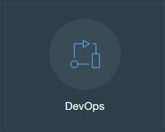
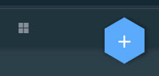
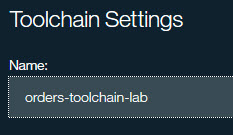

# Objective
This series of labs shows how to set up a productive toolchain with a sample that consists of three microservices. After you finish this part of the series, you will be familiar with a toolchain that demonstrates practices from the IBM�¢î Bluemix�¢î Garage Method. Toolchains are available in the US South region only.

## Prerequisites
Prior to running these labs, you must have a Bluemix account and access to a lab laptop.

- [Lab 1: Set-up Toolchain for Order](#lab-1-Set-up-Toolchain-for-Order)
- [Lab 2: Set-up Toolchain for Catalog](#lab-2-Set-up-Toolchain-for-Catalog)
- [Lab 3: Set-up Toolchain for UI](#lab-3-Set-up-Toolchain-for-UI)
- [Lab 4: Add Slack Integration](#lab-4-Add-Slack-Integration)
- [Lab 5: Deliver a UI Change](#lab-5-Deliver-a-UI-Change)

# Lab 1: Set-up Toolchain for Order
**Tasks**:
- [Task 1: Log into IBM Bluemix](#task-1-log-into-ibm-Bluemix)
- [Task 2: Create Toolchain for Order](#task-2-create-toolchain-for-order)
- [Task 3: Add and Configure GitHub Integration for Order](#task-3-add-and-configure-github-integration-for-order)
- [Task 4: Add Order Delivery Pipeline](#task-4-add-order-delivery-pipeline)
- [Task 5: Configure Order Delivery Pipeline](#task-4-configure-order-delivery-pipeline)
- [Task 4: Add and Configure GitHub Integration for Order](#task-3-add-and-configure-github-integration-for-order)

## Task 1: Log into IBM Bluemix
1. If you are not already logged into IBM Bluemix, log into IBM Bluemix.


## Task 2: Create Toolchain for Order
  1. Click on **DevOps**.
        
  2. Click on **Toolchains**.

  3. Click on the **+** plus icon on the right side of the screen.

  4. Click on **Build your own toolchain**.

  5. Under 'Toolchain Settings', enter the name "orders-toolchain-lab" and click **Create**.

Your Toolchain is created and you are redirected to the Toolchain panel.

## Task 3: Add and Configure GitHub Integration for Order
The code for the Order microservice already exists in a GitHub repository (https://github.com/open-toolchain/Microservices_OrdersAPI).  We will clone this repository and link to the clone.

  1. Click on the **+** plus icon on the right side of the screen to add a Tool Integration.
  2. Click on **GitHub** to add integration with GitHub to the Toolchain.


     1. Select 'Clone' as the Repository type.
     2. Enter "https://github.com/githubuserid/orders-api-toolchain-lab.git" for the New Repository Name.
     3. Enter "https://github.com/open-toolchain/Microservices_OrdersAPI" for the Source repository URL.
     4. Ensure The 'Enable GitHub Issues' checkbox is selected.
     
     5. Click **Create Integration**.
  3. The orders-toolchain-lab tool integrations is displayed.
       

## Task 4: Add Order Delivery Pipeline
Now that you have a Git repository clone of the code, we will add a Delivery Pipeline to deploy it and test it.

  1. Click on the **+** plus icon on the right side of the screen to add a Tool Integration.
  2. Click on **Delivery Pipeline** to create a new Delivery Pipeline (we will add tool integrations to this).
  3. Under 'Pipeline name:', enter "orders-toolchain-lab" and select the 'Show apps in the VIEW APP menu' checkbox.
  
  4. Click **Create Integration**.
  5. The orders-toolchain-lab delivery pipeline is displayed.
    

## Task 5: Configure Order Delivery Pipeline
  1. Now to configure the orders-toolchain-lab delivery pipeline. Four stages will be added: Build, Dev, Test and Prod.
    1. The **Build** stage has one job, performing the initial build of the code from the GitHub Repository.
    2. The **Dev** stage has one job, taking the output from the Build stage and deploying on Bluemix into the *dev* space.
    3. The **Test** stage has two jobs, taking the output from the Dev  stage and deploying on Bluemix into the *qs* space, then performing automated tests.
    4. The **Prod** stage has one job, taking the output from the Prod stage and deploying on Bluemix into the *prod* space.

    Click on the **Delivery Pipeline** tile.
    
  2. Add the **Build** stage and jobs.
    1. Click on **ADD STAGE**.
    2. On the **INPUT** tab, enter "Build" for Stage Name. Note that:
      1. 'Input Type' is set to a SCM Repository, in this case, Git.
      2. 'Git Repository' is set to the name of the Git Repository we just cloned.
      3. 'Git URL' is set to the URL of the Git Repository we just cloned.
      4. 'Branch' is set to "Master".
      5. 'Stage Trigger' is set to "Run jobs whenever a change is pushed to Git", resulting in the Build stage running continuously when Git is updated.
    
    3. Click the **Jobs** tab.
    4. Click **ADD JOB**.
    5. Click the **+** and select **Build** for the JOB TYPE.

      

    6. On the Job configuration panel, note that:
        1. 'Builder Type' is set to "Simple" (other options are available on the pull-down).
        2. 'Run Conditions' is set to "Stop running this stage if this job fails" to prevent any other jobs in this stage from running and to make the stage failed is this Job fails.


  3. Add the **Dev** stage.
  4. Add the **Test** stage.
  5. Add the **Prod** stage.


   DThese will deploy (respectively) to the dev, qa and prod Bluemix spaces. The Dev and Prod stages will have one job each (deploy to the Bluemix space) while the Test stage will have two stages (deploy to the Bluemix space and perform an automated test).

    On the 'Pipeline: All Stages' page, click **ADD STAGE**. The Stage Configuration page opens. 8.


  8.
    DThese will deploy (respectively) to the dev, qa and prod Bluemix spaces.  The Dev and Prod stages will have one job each (deploy to the Bluemix space) while the Test stage will have two stages (deploy to the Bluemix space and perform an automated test).

  On the 'Pipeline: All Stages' page, click **ADD STAGE**. The Stage Configuration page opens.
  8.


## Task 3: Add and Configure GitHub Interation
  1. Add and Configure Order
  2. Add and Configure Catalog
  3. Add and Configure UI

# Lab 1: Set-up Pipeline for Order

**Tasks**:
- [Task 1: Log into IBM Bluemix](#task-1-log-into-ibm-Bluemix)
- [Task 2: Add and Configure Order Delivery Pipeline](#task-2-add-and-configure-order-delivery-pipeline)
Add Dev Stage and Jobs
Run Dev Stage
Add Test Stage and Jobs
Run Test Stage
Add Prod Stage and Jobs
Run Prod Stage

## Task 1: Log into IBM Bluemix
1. If you are not already logged into IBM Bluemix, log into IBM Bluemix.


## Task 4: Add and Configure Delivery Pipeline for UI
1. Add Delivery Pipeline
2. Add and Configure Dev Environment Stage
    1. Examine Input
    2. Add Deploy Job
    3. Examine Environment Properties
3. Add and Configure Test Environment Stage
    1. Examine Input
    2. Add Deploy Job
    3. Add Sauce Lab Job
        1. Tester Type
        2. Configure Service Instance
    4. Examine Environment Properties
4. Add and Configure Prod Environment Stage
    1. Examine Input
    2. Add Deploy Job
    3. Examine Environment Properties
# Lab 2: Set-up Pipeline for Catalog
## Task 2: Create Toolchain
## Task 3: Add and Configure GitHub Interation for UI
1. Add
2. Configure
## Task 4: Add and Configure Delivery Pipeline for UI
1. Add Delivery Pipeline
2. Add and Configure Dev Environment Stage
    1. Examine Input
    2. Add Deploy Job
    3. Examine Environment Properties
3. Add and Configure Test Environment Stage
    1. Examine Input
    2. Add Deploy Job
    3. Add Sauce Lab Job
        1. Tester Type
        2. Configure Service Instance
    4. Examine Environment Properties
4. Add and Configure Prod Environment Stage
    1. Examine Input
    2. Add Deploy Job
    3. Examine Environment Properties


-----------------------------------------------------------------------------------------------------------
# Lab 1: Introduction to IBM Containers and Docker

> **Difficulty**: Easy

> **Time**: 20 minutes

> **Tasks**:
>- [Prerequisites](#prerequisites)
- [Task 1: Verify your environment](#task-1-verify-your-environment)
- [Task 2: Download your public images](#task-2-download-your-public-images)
- [Task 3: Log into IBM Containers using the CLI](#task-3-log-into-ibm-containers-using-the-cli)

## Prerequisites

Prior to running this lab, you must have a Bluemix account and access to a lab laptop.
Instructions are available in [prereqs](0-prereqs.md)
to create your Bluemix account, log into the Bluemix UI, and create a unique namespace.

## Task 1: Verify your environment

Docker Engine should be installed and running in your machine. In this task we will verify that Docker is running and run our first container.

1. Open a Terminal window.  Verify that you are running a recent Docker version by running the **"docker version"** command in the terminal.  You should see something similar to the following:

        $ docker version
        Client:
         Version:      1.8.3
         API version:  1.20
         Go version:   go1.4.2
         Git commit:   f4bf5c7
         Built:        Mon Oct 12 18:01:15 UTC 2015
         OS/Arch:      darwin/amd64

        Server:
         Version:      1.8.3
         API version:  1.20
         Go version:   go1.4.2
         Git commit:   f4bf5c7
         Built:        Mon Oct 12 18:01:15 UTC 2015
         OS/Arch:      linux/amd64

2. To get started with Docker, run a simple container locally, using the `hello-world` image with the command """docker run hello-world".

        $ docker run hello-world

        Hello from Docker.
        This message shows that your installation appears to be working correctly.

        To generate this message, Docker took the following steps:

              1. The Docker client contacted the Docker daemon.
              2. The Docker daemon pulled the "hello-world" image from the Docker Hub.
              3. The Docker daemon created a new container from that image which runs the
              executable that produces the output you are currently reading.
              4. The Docker daemon streamed that output to the Docker client, which sent it to your terminal.

        For more examples and ideas, visit [here](https://docs.docker.com/userguide/).

## Task 2: Download your public images

In this task, you will work with two public Docker images, [Let's Chat](https://github.com/sdelements/lets-chat) and [MongoDB](https://www.mongodb.org/).  The Let's Chat image is a web application that allows users to create message rooms for collaboration.  MongoDB is an open source, document-oriented database designed with both scalability and developer agility in mind.  

First, you will need to pull them down locally from the public [DockerHub](https://hub.docker.com/), which is a repository for Docker images.  By pulling (i.e., downloading) these images we will have them available on our workstation, which is required to run the images locally to learn how they function.

1. Pull the MongoDB image from DockerHub

        $ docker pull mongo
        Using default tag: latest
        latest: Pulling from library/mongo
        68e42ff590bd: Pull complete
        b4c4e8b590a7: Pull complete
        f037c6d892c5: Pull complete
        ...
        202e2c1fe066: Pull complete
        Digest: sha256:223d59692269be18696be5c4f48e3d4117c7f11e175fe760f6b575387abc1bba
        Status: Downloaded newer image for mongo:latest

2. Pull the Let's Chat image from DockerHub

        $ docker pull sdelements/lets-chat
        Using default tag: latest
        latest: Pulling from sdelements/lets-chat
        7a42f1433a16: Already exists
        3d88cbf54477: Already exists
        ...
        ca11de166bed: Already exists
        2409eb7b9e8c: Already exists
        Digest: sha256:98d1637b93a1fcc493bb00bb122602036b784e3cde25e8b3cae29abd15275206
        Status: Image is up to date for sdelements/lets-chat:latest

3. You can verify that containers can be deployed from these images and are compatible by running the applications locally.  Use the following "docker run" commands to start the two container instances.  The output is the unique container identifier and verifies completion of the executed command.

        Start a Mongo instance.  This will deploy a container that is running with the MongoDB inside.  
        ```
        $ docker run -d --name lc-mongo mongo  
        6ef19c325f6fda8f5c0277337dd797d4e31113daa7da92fbe85fe70557bfcb49
        ```


        Start a Let's Chat instance.  This will deploy a container with the Let's Chat application and link this container to the previously deployed MongoDB container.   
        ```
        $ docker run -d --name lets-chat --link lc-mongo:mongo -p 8080:8080 sdelements/lets-chat
        4180a983e329947196e317563037bfd0da093ab89add16911de90534c69a7822
        ```

4. Access the Let's Chat application through your browser using the loopback IP address (127.0.0.1).

           In your browser, access http://127.0.0.1:8080 or http://localhost:8080 or http://system_ip_here:8080.  

5. You can now stop and remove your local running containers.

        Stop the containers:  
        ```
        $ docker stop lets-chat lc-mongo
        lets-chat
        lc-mongo
        ```

        Delete the containers:  
        ```
        $ docker rm lets-chat lc-mongo
        lets-chat
        lc-mongo
        ```

## Task 3: Log into IBM Containers using the CLI

In this task, we will log into the IBM Containers command line to connect to Bluemix running on the IBM Cloud.

1. Back at your Terminal window, configure the Cloud Foundry CLI to work with the nearest IBM Bluemix region.  This ensures you will be working with the US South region of Bluemix.  To use the London datacenter, the API endpoint is "cf api https://api.eu-gb.bluemix.net".

        $ cf api https://api.ng.bluemix.net
        Setting api endpoint to https://api.ng.bluemix.net...
        OK

2. Log in to Bluemix through the Cloud Foundry CLI

        $ cf login
        API endpoint: https://api.ng.bluemix.net

        Email> <ENTER_EMAIL_USED_WHEN_CREATING_BLUEMIX_ACCOUNT> i.e., osowski@us.ibm.com

        Password>
        Authenticating...
        OK

        Select an org (or press enter to skip):
        1. osowski@us.ibm.com
        2. IBM_Containers_Demo_Org

        Org> 2
        Targeted org IBM_Containers_Demo_Org

        Targeted space IBM_Containers_Demo_Org


        API endpoint:   https://api.ng.bluemix.net (API version: 2.40.0)   
        User:           osowski@us.ibm.com   
        Org:            IBM_Containers_Demo_Org   
        Space:          IBM_Containers_Demo_Org

3. Log in to the IBM Container service on Bluemix

        $ cf ic login
        Client certificates are being retrieved from IBM Containers...
        Client certificates are being stored in /Users/osowski/.ice/certs/containers-api.ng.bluemix.net...
        OK
        Client certificates were retrieved.

        Checking local Docker configuration...
        OK

        Authenticating with registry at host name registry.ng.bluemix.net
        OK
        Your container was authenticated with the IBM Containers registry.
        Your private Bluemix repository is URL: registry.ng.bluemix.net/ibm_containers_demo

        You can choose from two ways to use the Docker CLI with IBM Containers:

        Option 1: This option allows you to use "cf ic" for managing containers on IBM Containers while still using the Docker CLI directly to manage your local Docker host.
        	Use this Cloud Foundry IBM Containers plug-in without affecting the local Docker environment:

        	Example Usage:
        	cf ic ps
        	cf ic images

        Option 2: Use the Docker CLI directly. In this shell, override the local Docker environment to connect to IBM Containers by setting these variables. Copy and paste the following commands:
        	Note: Only Docker commands followed by (Docker) are supported with this option.

 	        export DOCKER_HOST=tcp://containers-api.ng.bluemix.net:8443
         	export DOCKER_CERT_PATH=/Users/osowski/.ice/certs/containers-api.ng.bluemix.net
         	export DOCKER_TLS_VERIFY=1

        	Example Usage:
        	docker ps
        	docker images

## Congratulations!!!  You have successfully accomplished Lab 1.

#### Let's recap what you've accomplished thus far:

- Verified your Docker version
- Downloaded and ran your first Docker container
- Downloaded two new Docker images to run locally on your development VM
- Logged into the IBM Containers command line

### Time to continue with [Lab 2 - Running Docker Images in IBM Containers](2-Running-Docker-Images-in-IBM-Containers.md)
