# Lab 1: Set-up Toolchain for Order

## Objective
This lab creates and configures the Toolchain for the Order application.

**Tasks**:
- [Task 1: Log into IBM Bluemix](#task-1-log-into-ibm-bluemix)
- [Task 2: Create Toolchain](#task-2-create-toolchain)
- [Task 3: Add and Configure GitHub Integration for Order](#task-3-add-and-configure-github-integration-for-order)
- [Task 4: Add Order Delivery Pipeline](#task-4-add-order-delivery-pipeline)
- [Task 5: Configure Order Delivery Pipeline](#task-4-configure-order-delivery-pipeline)

## Task 1: Log into IBM Bluemix
1. If you are not already logged into IBM Bluemix, log into IBM Bluemix (https://www.ibm.com/cloud-computing/bluemix/).
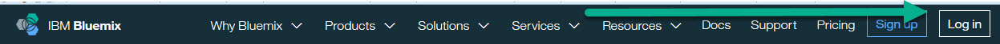

## Task 2: Create Toolchain
  1. We need to get to the DevOps Services. Click on the **Bluemix menu bar**

  

  and click on **Services** then **DevOps**.

  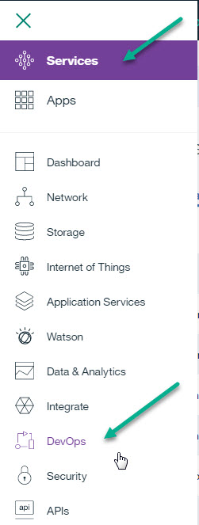

  2. Click on **Toolchains**.

  
  3. Click on **Create a Toolchain** on the right side of the screen.

  
  4. Click on **Build your own toolchain**.

  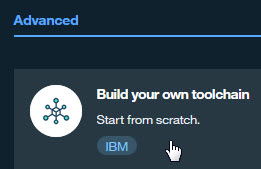
  5. Under 'Toolchain Settings', enter the name "devops-toolchain-lab" and click **Create**.

  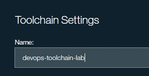

  Your Toolchain is created and you are redirected to the Toolchain panel.

## Task 3: Add and Configure GitHub Integration for Order
The code for the Order microservice already exists in a GitHub repository (https://github.com/open-toolchain/Microservices_OrdersAPI).  We will clone this repository and link to the clone.

  1. Click on **Add a tool** on the right side of the screen to add a Tool Integration.
  2. Click on **GitHub** to add integration with GitHub to the Toolchain.

  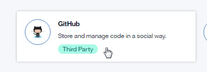

<ul>
<li>Select 'Clone' as the Repository type.
<li>Enter "<i>githubuserid</i>/orders-api-toolchain-lab.git" for the New Repository Name.
 where <i>githubuserid</i> is your GitHub userid.
<li>Enter "https://github.com/open-toolchain/Microservices_OrdersAPI" for the Source repository URL.
<li>Ensure the 'Enable GitHub Issues' checkbox is selected.
</ul>

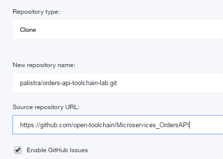

<ul>     
<li>Click <b>Create Integration</b>.
</ul>

  The devops-toolchain-lab tool integrations is displayed.

  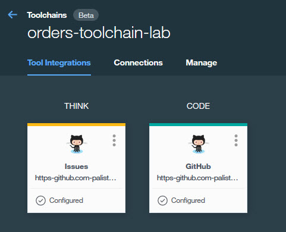

## Task 4: Add Order Delivery Pipeline
Now that you have a Git repository clone of the code, we will add a Delivery Pipeline to deploy it and test it.

  1. Click on **Add a Tool** on the right side of the screen to add a Tool Integration.
  2. Click on **Delivery Pipeline** to create a new Delivery Pipeline (we will add tool integrations to this).
  3. Under 'Pipeline name:', enter "orders-api-toolchain-lab".

  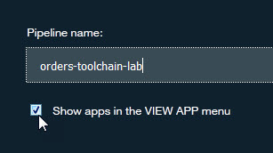
  4. Click **Create Integration**.
  5. The devops-toolchain-lab delivery pipeline is displayed.

    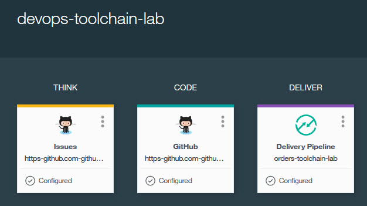

## Task 5: Configure Order Delivery Pipeline

<ol>
<li>Now to configure the <b>orders-api-toolchain-lab</b> delivery pipeline. Four stages will be added: Build, Dev, Test and Prod.
<ul>
<li>The <b>Build</b> stage has one job, performing the initial build of the code from the GitHub Repository.
<li>The <b>Dev</b> stage has one job, taking the output from the Build stage and deploying on Bluemix into the <i>dev</i> space.
<li>The <b>Test</b> stage has two jobs, taking the output from the Dev stage and deploying on Bluemix into the <i>qa</i> space, then performing automated tests.
<li>The <b>Prod</b> stage has one job, taking the output from the Test stage and deploying on Bluemix into the <i>prod</i> space.  This stage will also check to see there is an earlier instance of this application running and if it is, keep it around in case the deploy of the new version of the app has problems.  If the new version deploys successfully, the old version is deleted.  If not, the new version is deleted and the old version continues to run.
</ul>

Click on the <b>Delivery Pipeline</b> tile for the <b>orders-api-toolchain-lab</b> pipeline.

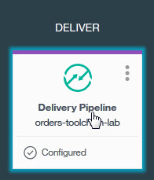
<li>Add the <b>Build</b> stage and jobs.
<ol>
    <li>Click on <b>ADD STAGE</b>.
    <li>On the <b>INPUT</b> tab, change "MyStage" to "Build" for Stage Name. Note that:
    <ul>
    <li>'Input Type' is set to a SCM Repository, in this case, Git.
    <li>'Git Repository' is set to the name of the Git Repository we just cloned. Make sure to select the "order" repo from the dropdown list.
    <li>'Git URL' is set to the URL of the Git Repository we just cloned.
    <li>'Branch' is set to "Master".
    <li>'Stage Trigger' is set to "Run jobs whenever a change is pushed to Git", resulting in the Build stage running continuously when Git is updated.
    

    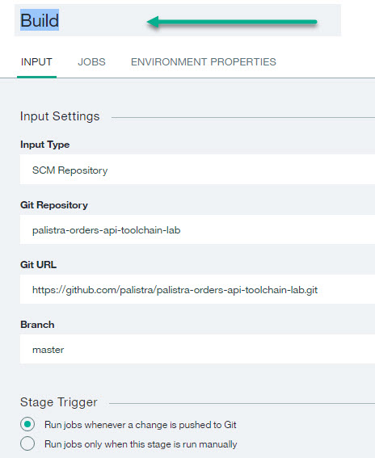
    </ul>
    <li>Click the <b>Jobs</b> tab.
    <li>Click <b>ADD JOB</b>.
    <li>Click the <b>+</b> and select <b>Build</b> for the JOB TYPE.
    

    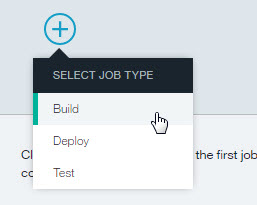
    <li>On the Job configuration panel, note that:
    <ul>
    <li>'Builder Type' is set to "Simple" (other options are available on the pull-down).
    <li>'Run Conditions' is set to "Stop running this stage if this job fails" to prevent any other jobs in this stage from running and to make the stage failed if this Job fails.
    

    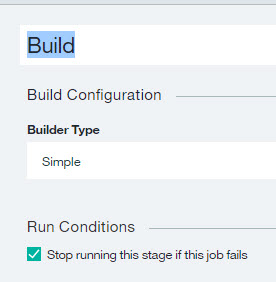
    </ul>
    <li>Click <b>Save</b> to save the <b>Build</b> stage.
    <li>The <b>Delivery Pipeline</b> displays the <b>Build</b> stage.  This stage has not been run. Click on the <b>Run Stage</b> icon to run the build.
    

    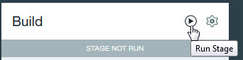
    
The JOBS section shows the Build was successful.
    

    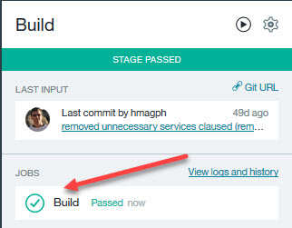
    
The <b>Build</b> stage has been successfully added and executed.
</ol>
<li>Add the <b>Dev</b> stage and jobs (remember, just one job, deploying to the <i>dev</i> space).
<ol>
    <li>Click on <b>ADD STAGE</b>.
    <li>On the <b>INPUT</b> tab, enter "Dev" for Stage Name. Note that:
    <ul>
    <li>'Input Type' is set to Build Artifacts (from the <b>Build</b> stage).
    <li>'Stage' and 'Job' are both 'Build'.
    <li>'Stage Trigger' is set to "Run jobs when the previous stage is completed", resulting in the Dev stage running when the <b>Build</b> stage successfully completes.
    </ul>
    <li>Click the <b>Jobs</b> tab.
    <li>Click <b>ADD JOB</b>.
    <li>Click the <b>+</b> and select <b>Deploy</b> for the JOB TYPE.
    <li>On the Job configuration panel, note that:
    <ul>
    <li>'Deployer Type' is set to "Cloud Foundry" (other options are available on the pull-down).
    <li>'Target' is set to "US South - https://api.ng/bluemix.net" as this is where the code will be deployed.
    <li>'Space' is set to "dev" (or Create a new space called <b>dev</b> if not on the dropdown).
    <li>'Application Name' is "orders-api-toolchain-lab".
    <li>Type the following into the "Deploy Script" section.
<pre><code>
#!/bin/bash
#get user name
a=$(cf services | grep @)
b=${a%@&#42;}
c=($b)
len=${#c[@]}
user_name=${c[len-1]}
#add Cloudant service
cf create-service cloudantNoSQLDB Lite myMicroservicesCloudant
# Push app
export CF_APP_NAME="$user_name-dev-$CF_APP"
cf push "${CF_APP_NAME}"
echo "Pushed App Name: ${CF_APP_NAME}."
# View logs
#cf logs "${CF_APP_NAME}" --recent
</code></pre>    
    
When an app is pushed to a space, its name is used as part of its route name.  Routes need to be unique inside Bluemix.  When there are multiple people doing the lab, they will all have the same routes, such as dev-orders-api-toolchain-lab.mybluemix.org.  The first part of the bash script adds the user name to the app name to keep it unique.
    <li>'Run Conditions' is set to "Stop running this stage if this job fails" to prevent any other jobs in this stage from running and to make the stage failed is this Job fails.
    

    
    </ul>
    <li>The bash script just entered into the Deploy Script references the <i>CF_APP_NAME</i> environment variable (<i>CF_APP</i> is provided by default).  CF_APP_NAME needs to be added to the environment variables.
    <li>Click the <b>ENVIRONMENT PROPERTIES</b> tab.
    <li>Click <b>ADD PROPERTY</b> and select <b>Text Property</b>.
    <li>Enter "CF_APP_NAME" as the 'Name'.  Do not enter anything for the 'Value'.
    <li>Click <b>Save</b> to save the <b>Dev</b> stage.
    <li>The <b>Delivery Pipeline</b> displays the <b>Build</b> and <b>Dev</b> stages.  The <b>Dev</b> stage has not been run. Click on the <b>Run Stage</b> icon to run the <b>Dev</b> stage and deploy the order API.
    

    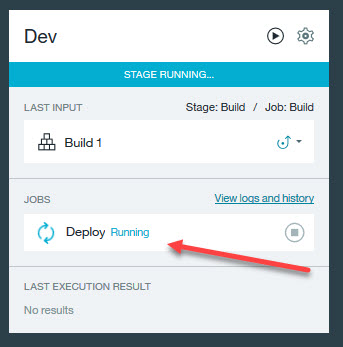
    
The JOBS section shows the Deploy job Passed.
    Click on the "Deploy" Jobs to to view the log for that Job.
    

    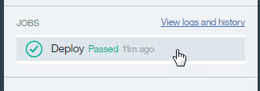
    <li>Scroll to the bottom of the log to see the result.
    

    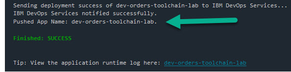
    <li>Click on the navigation arrow to return to the orders-api-toolchain-lab Delivery Pipeline.
    

    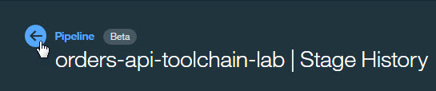
    <li>LAST EXECUTION RESULT displays the url to the successfully deployed application (<i>user_name</i>-dev-orders-api-toolchain-lab.mybluemix.net) as well as a link to the runtime log.
    

    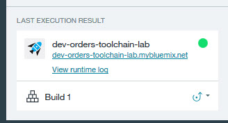
    <li>Click on "<i>user_name</i>-dev-orders-api-toolchain-lab.mybluemix.net" to access the running application.
    

    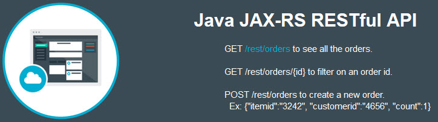
    <li>CLose the application window.    
</ol>

The <b>Dev</b> stage has been successfully added and executed.
<li>Add the <b>Test</b> stage (remember, two jobs, one to deploy to the <i>qa</i> space and another to perform an automated test).  We will clone the <b>Dev</b> stage and make some modifications.
<ol>
    <li>Ensure the orders-api-toolchain-lab <b>Delivery Pipeline</b> is displayed.
    <li>On the <b>Dev</b> stage, click the <b>Stage Configuration</b> gear and select "Clone Stage".
    

    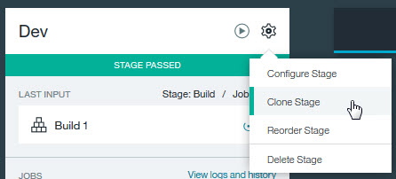
    <li>Rename the cloned stage to <b>Test</b> (from <b>Dev [copy]</b>).
    <li>On the <b>Jobs</b> tab, change the space to <b>qa</b> (from <b>dev</b>) (or Create a new space called <b>qa</b> if not on the dropdown) and change the deploy script to change CF_APP_NAME to "$user_name-test-$CF_APP" (from "$user_name-dev-$CF_APP").
    

    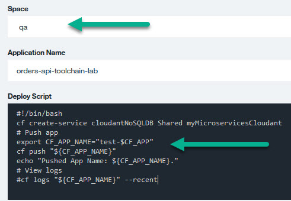
    <li>Add a new Job of type Test called <b>Test</b>.  There are a number of different Testers available. For this exercise, we will select the default Simple Tester. Enter the following code to the <b>Test Command</b>.
<pre><code>
#!/bin/bash
# invoke tests here
echo "Testing of App Name ${CF_APP_NAME} was successful"      
</code></pre>
This 'test' script just echos the app name to the console log.  In a real environment, we would execute automated test tools and scripts to validate the deployed service still worked.
 
    <li>Click the <b>ENVIRONMENT PROPERTIES</b> tab. Note the environment variable CF_APP_NAME is already present.
    <li>Click <b>Save</b> to save the <b>Test</b> stage.
    <li>The <b>Delivery Pipeline</b> displays the <b>Build</b> and <b>Dev</b> stages.  The <b>Test</b> stage has not been run.
    Click on the <b>Run Stage</b> icon to run the <b>Test</b> stage and deploy the order API to the <i>test</i> space.
    <li>As before for the <b>Dev</b> stage, the JOBS section shows the Deploy and Test Jobs were successful. Click <b>Test</b> to display the log for the <b>Test</b> job.
    

    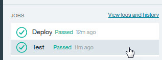
    <li>The <b>Test</b> job was successful.
    

    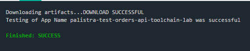
     Click on "<i>user_name</i>-test-orders-api-toolchain-lab.mybluemix.net" to access the running application.
    
The <b>Test</b> stage has been successfully added and executed.  Close the browser tab with the running application.
</ol>

<li>Add the <b>Prod</b> stage (remember, one job to deploy to the <i>prod</i> space).   This stage will also check to see there is an earlier instance of this application running and if it is, keep it around in case the deploy of the new version of the app has problems.  If the new version deploys successfully, the old version is deleted.  If not, the new version is deleted and the old version continues to run.
 We will clone the <b>Dev</b> stage and make some modifications.
<ol>
<li>Click on the navigation arrow to return to the orders-api-toolchain-lab Delivery Pipeline.
<li>On the <b>Dev</b> stage, click the <b>Stage Configuration</b> and select "Clone Stage".
<li>Rename the cloned stage to <b>Prod</b> (from <b>Dev [copy]</b>).
<li>On the <b>Jobs</b> tab, change the Job name to '<b>Blue/Green Deploy</b>' (from <b>Deploy</b>), change the space to <b>prod</b> (from <b>dev</b>) (or Create a new space called <b>prod</b> if not on the dropdown) and change the deploy script to the following:
<pre><code>
#!/bin/bash
#get user name
a=$(cf services | grep @)
b=${a%@&#42;}
c=($b)
len=${#c[@]}
user_name=${c[len-1]}
export CF_APP_NAME="$user_name-Prod-$CF_APP"
#add Cloudant service
cf create-service cloudantNoSQLDB Lite myMicroservicesCloudant
if ! cf app $CF_APP_NAME; then  
  cf push $CF_APP_NAME
else
  OLD_CF_APP=${CF_APP_NAME}-OLD-$(date +"%s")
  rollback() {
    set +e  
    if cf app $OLD_CF_APP; then
      cf logs $CF_APP_NAME --recent
      cf delete $CF_APP_NAME -f
      cf rename $OLD_CF_APP $CF_APP_NAME
    fi
    exit 1
  }
  set -e
  trap rollback ERR
  cf rename $CF_APP_NAME $OLD_CF_APP
  cf push $CF_APP_NAME
  cf delete $OLD_CF_APP -f
fi
</code></pre>

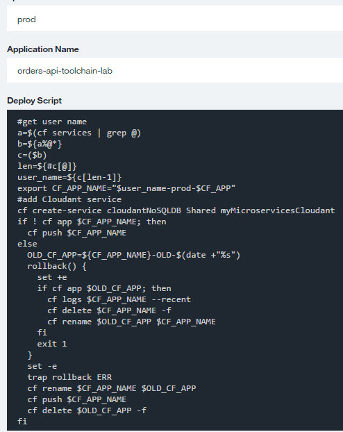
<li>Click the <b>ENVIRONMENT PROPERTIES</b> tab. Note that the environment variable CF_APP_NAME is already present.
<li>Click <b>Save</b> to save the <b>Prod</b> stage.
<li>Click on <b>Run Stage</b> to run the <b>Prod</b> stage and deploy the order API to the <i>prod</i> space.
<li>The JOBS section shows the Deploy was successful. Inspect the Job log.
    

    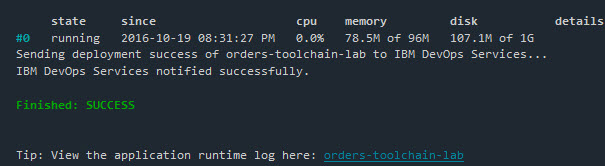
<li>Click <b>Redeploy</b> to redeploy the stage.  
<li>The JOBS section shows the Redeploy was successful. Inspect the Job log.  Note the application was renamed, replace and the old version deleted.
    

    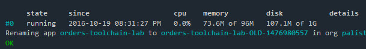
    <li>Click on the blue arrow (upper left) to display the Delivery Pipeline.
    <li>Click on "<i>user_name</i>-prod-orders-api-toolchain-lab.mybluemix.net" to access the running application.
     
    
    
The <b>Prod</b> stage has been successfully added and executed.  The Orders application has been deployed to production.
    <li>Close the application window.
    <li>Click on the blue arrow (upper left) to return to the devops-toolchain-lab Toolchain.
</ol>
