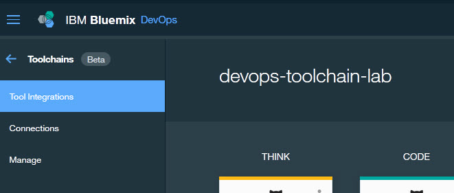
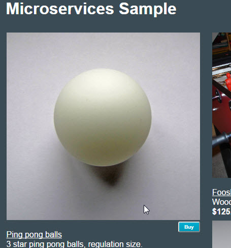

# Lab 3: Set-up Toolchain for UI

## Objective
This lab adds the UI application to the Toolchain.  You may want to refer to the prior lab if you need additional details.

**Tasks**:
- [Task 1: Go to devops-toolchain](#task-1-go-to-devops-toolchain)
- [Task 2: Create Toolchain for UI](#task-1-create-toolchain-for-ui)
- [Task 3: Add and Configure GitHub Integration for UI](#task-2-add-and-configure-github-integration-for-ui)
- [Task 4: Add UI Delivery Pipeline](#task-3-add-ui-delivery-pipeline)
- [Task 5: Configure UI Delivery Pipeline](#task-4-configure-ui-delivery-pipeline)

## Task 1: Go to devops-toolchain
<ol compact>
<li>If you are not on <b>devops-toolchain-lab</b> Toolchain:

perform the following steps:
<ol>
<li>Click on the Bluemix Menu Bar

<li>Click <b>Services</b>
<li>Select DevOps to display all the Toolchains.
<li>Click on the <b>devops-toolchain-lab</b> tile.
</ol>

## Task 2: Add and Configure GitHub Integration for UI
The code for the UI microservice already exists in a GitHub repository (https://github.com/open-toolchain/Microservices_UI).  We will clone this repository and link to the clone.
<ol>
<li>Click on <b>Add a Tool</b> on the right side of the screen to add a Tool Integration.
<li>Click on <b>GitHub</b> to add integration with GitHub to the Toolchain.
<li>Select 'Clone' as the Repository type.
<li>Enter "<i>githubuserid</i>/UI-toolchain-lab.git" for the New Repository Name.
 where <i>githubuserid</i> is your GitHub userid.
<li>Enter "https://github.com/open-toolchain/Microservices_UI" for the Source repository URL.
<li>Ensure the 'Enable GitHub Issues' checkbox is selected.
<li>Click <b>Create Integration</b>.
<li>The <b>devops-toolchain-lab</b> Toochain is displayed.
</ol>

## Task 3: Add UI Delivery Pipeline
Now that you have a Git repository clone of the code, we will add a Delivery Pipeline to deploy it and test it.

  1. Click on **Add a Tool** on the right side of the screen to add a Tool Integration.
  2. Click on **Delivery Pipeline** to create a new Delivery Pipeline (we will add tool integrations to this).
  3. Under 'Pipeline name:', enter "ui-toolchain-lab" and select the 'Show apps in the VIEW APP menu' checkbox.
  4. Click **Create Integration**.

## Task 4: Configure UI Delivery Pipeline

<ol>
<li>Now to configure the ui-toolchain-lab delivery pipeline. Four stages will be added: Build, Dev, Test and Prod.
<ul>
<li>The <b>Build</b> stage has one job, performing the initial build of the code from the GitHub Repository.
<li>The <b>Dev</b> stage has one job, taking the output from the Build stage and deploying on Bluemix into the <i>dev</i> space.
<li>The <b>Test</b> stage has two jobs, taking the output from the Dev stage and deploying on Bluemix into the <i>qa</i> space, then performing automated tests.
<li>The <b>Prod</b> stage has one job, taking the output from the Test stage and deploying on Bluemix into the <i>prod</i> space.  This stage will also check to see there is an earlier instance of this application running and if it is, keep it around in case the deploy of the new version of the app has problems.  If the new version deploys successfully, the old version is deleted.  If not, the new version is deleted and the old version continues to run.
</ul>

Click on the <b>Delivery Pipeline</b> tile for the ui-toolchain-lab delivery pipeline.
<li>Add the <b>Build</b> stage and jobs.
<ol>
    <li>Click on <b>ADD STAGE</b>.
    <li>On the <b>INPUT</b> tab, enter "Build" for Stage Name. Note that:
    <ul compact>
    <li>'Input Type' is set to a SCM Repository, in this case, Git.
    <li>Make sure 'Git Repository' points to the "UI" repo from the dropdown list.    
    <li>'Git URL' is set to the URL of the Git Repository we just cloned.
    <li>'Branch' is set to "Master".
    <li>'Stage Trigger' is set to "Run jobs whenever a change is pushed to Git", resulting in the Build stage running continuously when Git is updated.
    </ul>
    <li>Click the <b>Jobs</b> tab.
    <li>Click <b>ADD JOB</b>.
    <li>Click the <b>+</b> and select <b>Build</b> for the JOB TYPE.
    <li>On the Job configuration panel, note that:
    <ul compact>
    <li>'Builder Type' is set to "Simple" (other options are available on the pull-down).
    <li>'Run Conditions' is set to "Stop running this stage if this job fails" to prevent any other jobs in this stage from running and to make the stage failed is this Job fails.
    </ul>
    <li>Click <b>Save</b> to save the <b>Build</b> stage.
    <li>The <b>Delivery Pipeline</b> displays the <b>Build</b> stage.  This stage has not been run. Click on the <b>Run Stage</b> icon to run the build.
    
The JOBS section shows the Build was successful.
    
The <b>Build</b> stage has been successfully added and executed.
</ol>
<li>Add the <b>Dev</b> stage and jobs (remember, one job, taking the output from the Build stage and deploying on Bluemix into the <i>dev</i> space).
<ol>
    <li>Click on <b>ADD STAGE</b>.
    <li>On the <b>INPUT</b> tab, enter "Dev" for Stage Name. Note that:
    <ul compact>
    <li>'Input Type' is set to Build Artifacts (from the <b>Build</b> stage).
    <li>'Stage' and 'Job' are both 'Build'.
    <li>'Stage Trigger' is set to "Run jobs when the previous stage is completed", resulting in the Dev stage running when the <b>Build</b> stage successfully completes.
    </ul>
    <li>Click the <b>Jobs</b> tab.
    <li>Click <b>ADD JOB</b>.
    <li>Click the <b>+</b> and select <b>Deploy</b> for the JOB TYPE.
    <li>On the Job configuration panel, note that:
    <ul compact>
    <li>'Deployer Type' is set to "Cloud Foundry" (other options are available on the pull-down).
    <li>'Target' is set to "US South - https://api.ng/bluemix.net" as this is where the code will be deployed.
    <li>'Space' is set to "dev" (or Create a new space called <b>dev</b> if not on the dropdown).
    <li>Type the following into the "Deploy Script" section. This will deploy the UI application.
<pre><code>
#!/bin/bash
#get user name
a=$(cf services | grep @)
b=${a%@&#42;}
c=($b)
len=${#c[@]}
user_name=${c[len-1]}
# Push app
export CF_APP_NAME="$user_name-dev-$CF_APP"
cf push "${CF_APP_NAME}"
echo "Pushed App Name: ${CF_APP_NAME}."
# View logs
#cf logs "${CF_APP_NAME}" --recent
</code></pre>
    <li>'Run Conditions' is set to "Stop running this stage if this job fails" to prevent any other jobs in this stage from running and to make the stage failed is this Job fails.
    </ul>
    <li>Add the CF_APP_NAME environment variable.
    <li>Click <b>Save</b> to save the <b>Dev</b> stage.
    <li>The <b>Delivery Pipeline</b> displays the <b>Build</b> and <b>Dev</b> stages.  The <b>Dev</b> stage has not been run. Click on the <b>Run Stage</b> icon to run the <b>Dev</b> stage to deploy the UI application.
    
The JOBS section shows the Stage was successful. Click on "View logs and history" to the Job log.
    <li>LAST EXECUTION RESULT displays the url to the successfully deployed application (dev-ui-toolchain-lab.mybluemix.net) as well as a link to the runtime log.
     Click on "dev-ui-toolchain-lab.mybluemix.net" to access the running application.
    
The <b>Dev</b> stage has been successfully added and executed.
</ol>

<li>Add the <b>Test</b> stage (remember, two jobs, one to deploy to the <i>test</i> space and another to perform an automated test).  We will clone the <b>Dev</b> stage and make some modifications.
<ol>
    <li>Ensure the <b>Delivery Pipeline</b> is displayed.
    <li>On the <b>Dev</b> stage, click the <b>Stage Configuration</b> and select "Clone Stage".
    <li>Rename the cloned stage from <b>Dev [copy]</b> to <b>Test</b>.
    <li>On the <b>Jobs</b> tab, change the space from <b>dev</b> to <b>qa</b> (or Create a new space called <b>qa</b> if not on the dropdown) and change the deploy script to change CF_APP_NAME to "test-$CF_APP" from "dev-$CF_APP".
    <li>Add a new Job of type Test called <b>Test</b>. Select the default Simple Tester. Enter the following code to the <b>Test Command</b>.
    <pre>    
      #!/bin/bash
      # invoke tests here
      echo "Testing of App Name ${CF_APP_NAME} was successful"      
    </pre>
    
If we had a SauceLabs account, this is a place where we could run some automated UI tests.
    <li>Click <b>Save</b> to save the <b>Test</b> stage.
    <li>The <b>Delivery Pipeline</b> displays the <b>Build</b> and <b>Dev</b> stages.  The <b>Test</b> stage has not been run.
    Click on the <b>Run Stage</b> icon to run the <b>Test</b> stage and deploy the order API to the <i>test</i> space.
    <li>As before for the <b>Dev</b> stage, the JOBS section shows the Deploy and Test Jobs were successful. Click <b>Test</b> to display the log for the <b>Test</b> job.
     Click on "<i>user_name</i>-test-ui-toolchain-lab.mybluemix.net" to access the running application.
    
The <b>Test</b> stage has been successfully added and executed.
</ol>

<li>Add the <b>Prod</b> stage (remember, one job, to deploy to the <i>prod</i> space).   This stage will also check to see there is an earlier instance of this application running and if it is, keep it around in case the deploy of the new version of the app has problems.  If the new version deploys successfully, the old version is deleted.  If not, the new version is deleted and the old version continues to run.
 We will clone the <b>Dev</b> stage and make some modifications.
<ol>

<li>Ensure the <b>Delivery Pipeline</b> is displayed.
    <li>On the <b>Dev</b> stage, click the <b>Stage Configuration</b> and select "Clone Stage".
    <li>Rename the cloned stage from <b>Dev [copy]</b> to <b>Prod</b>.
    <li>On the <b>Jobs</b> tab, change the Job name to 'Blue/Green Deploy', change the space from <b>dev</b> to <b>prod</b> (or Create a new space called <b>prod</b> if not on the dropdown) and change the deploy script to the following:
<pre><code>
#!/bin/bash
#get user name
a=$(cf services | grep @)
b=${a%@&#42;}
c=($b)
len=${#c[@]}
user_name=${c[len-1]}
export CF_APP_NAME="$user_name-prod-$CF_APP"
if ! cf app $CF_APP_NAME; then  
  cf push $CF_APP_NAME
else
  OLD_CF_APP=${CF_APP_NAME}-OLD-$(date +"%s")
  rollback() {
    set +e  
    if cf app $OLD_CF_APP; then
      cf logs $CF_APP_NAME --recent
      cf delete $CF_APP_NAME -f
      cf rename $OLD_CF_APP $CF_APP_NAME
    fi
    exit 1
  }
  set -e
  trap rollback ERR
  cf rename $CF_APP_NAME $OLD_CF_APP
  cf push $CF_APP_NAME
  cf delete $OLD_CF_APP -f
fi
</code></pre>
    <li>Click <b>Save</b> to save the <b>Prod</b> stage.
    <li>Click on <b>Run Stage</b> to run the <b>Prod</b> stage and deploy the order API to the <i>prod</i> space.
    <li>The JOBS section shows the Deploy was successful. Inspect the Job log.
     Click on the blue arrow to display the Delivery Pipeline. Click on "<i>user_name</i>-ui-toolchain-lab.mybluemix.net" to access the running application.  You could also click on the <b>View App</b> pull-down and select the "<i>user_name</i>-ui-toolchain-lab.mybluemix.net".
    

    
    
The <b>Prod</b> stage has been successfully added and executed.  The UI application has been deployed to production.
</ol>
