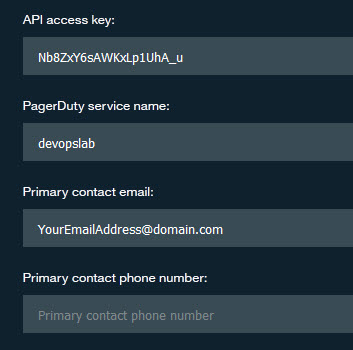
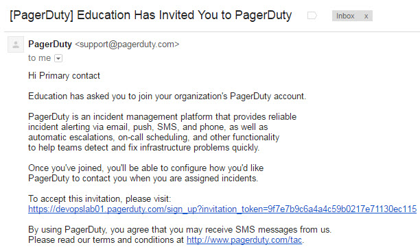
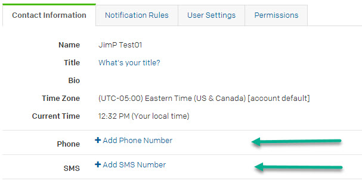
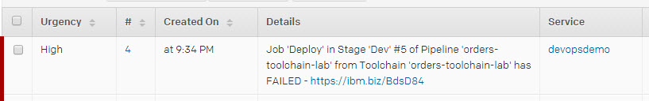
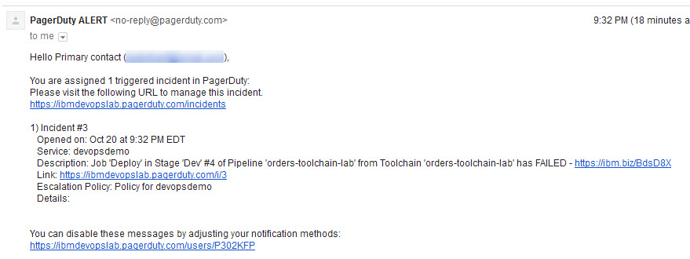
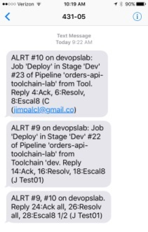
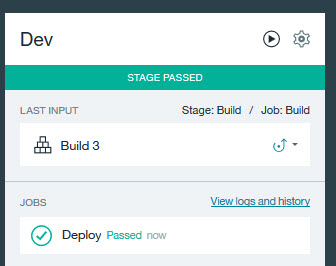

# Lab 4: Add PagerDuty Integration

# Objective
This lab show how to integrate your toolchain with PagerDuty so teams get notified when things go wrong so problems can be fixed faster and reduce downtime.

## Prerequisites
If you want to see email notifications from PagerDuty, you will need access to an eMail account.  Once the integration is created, you can check that account to accept the invitation to join PagerDuty and to see alerts from PagerDuty.

**Tasks**:
- [Task 1: Add PagerDuty to Toolchain](#task-1-add-pagerduty-to-toolchain)
- [Task 2: Verify PagerDuty works by breaking application build](#task-2-verify-pagerduty-works-by-breaking-application-build)
- [Task 3: Fix application](#task-3-fix-application)

## Task 1: Add PagerDuty to Toolchain
As a developer or operations person, you may want to be notified of the status of code deployments.  One way to be alerted  is to integrate third-party tools such as [PagerDuty](https://www.pagerduty.com/).  IBM Bluemix has made it easy to add PagerDuty integration into a Toolchain so the teams such as development or operations are notified of the status of deployments.

**Note:** The PagerDuty integration feature is not created by, affiliated with, or supported by PagerDuty, Inc.

1. On the devops-toolchain-lab toolchain's Tool Integrations page, click **Add a Tool**
2. Select **PagerDuty**
3. On the PagerDuty Configuration page:
   - Enter 7x-RJtTJr9H-wCn-aJCk as the API access key
   - Enter "devopslab" as the PagerDuty service name
   - Enter an email address you can access.  Leave the phone number blank.  PagerDuty has a place for you to enter your phone number if you want to receive text messages or receive phone calls.

4. Click **Create Integration**

  
5. You can access the eMail account to accept the PagerDuty invitation.

  

6. You can enter your phone information into your PagerDuty account (if you have one).  If you do this, you will get text messages and/or phone calls, depending on where you entered your phone number.  Normal messaging rates apply.

  

  The list of countries PagerDuty supports is at: [PagerDuty Country Support](https://support.pagerduty.com/hc/en-us/articles/202828860-Countries-PagerDuty-supports-for-SMS-and-phone-call-notifications)

## Task 2: Add Eclipse Orion Web IDE to Toolchain
We want to modify the application and one way is to use the Web IDE.

1. On the toolchain's Tool Integrations page, click the add button **+**
2. Select **Eclipse Orion Web IDE**.
3. No configuration is needed. so click **Create Integration**.

## Task 3: Verify PagerDuty works by breaking application build
  1. On the toolchain's Tool Integrations page, click the **Eclipse Orion Web IDE** tile. The GitHub repos are automatically loaded in your workspace. The Web IDE workspace is on the cloud.
  2. In the file navigator, expand the orders-api-toolchain_name repo (if needed).
  3. In the file directory, click manifest.yml to open the file.

  
  4. Update the value for memory to 96**g**. This setting intentionally increases your memory to exceed the quota for your org. Your changes are automatically saved.
  5. Now to Push the changes.  From the Eclipse Orion Web IDE menu, click the **Git** icon.

  

  6. In the Working Directory Changes section, which is in the upper-right corner of the window, make sure that the changed file is selected.  Enter a relevant comment.

  
  7. Click **Commit** to put the changes in the local master branch.
  8. Put these changes in the origin/master branch and click **Push**. Your changes are automatically built and deployed in the pipeline.
  9. Return to devops-toolchain-lab toolchain's Tool Integrations page and click the pipeline tile for the orders-api microservice to watch the stages run in response to your commit (you may have to manually start the Build if it does not start automatically).
  10. The Deploy fails.

  
  11. The PagerDuty console (https://devopslab01.pagerduty.com/incidents) shows the incident:

  
  12. The account you entered when you setup the PagerDuty integration will have an alert. The link in the email will allow you to view the incident on PagerDuty (assuming you accepted the invitation from PagerDuty).

  
  13. If you added a mobile phone number to your PagerDuty account, that phone will receive an alert and/or phone message.
  

## Task 4: Fix application

Now to fix the application.
  1. On the toolchain's Tool Integrations page, click the **Eclipse Orion Web IDE** tile.
  2. In the file navigator, expand the orders-api-toolchain_name repo (if needed).
  3. In the file directory, click manifest.yml to open the file.
  4. Update the value for memory to 96m.
  5. Now to Push the changes.  From the Eclipse Orion Web IDE menu, click the **Git** icon.
  6. In the Working Directory Changes section, which is in the upper-right corner of the window, make sure that the changed file is selected.
  7. Click **Commit** to put the changes in the local master branch.
  8. Put these changes in the origin/master branch and click **Push**. Your changes are automatically built and deployed in the pipeline.
  9. Return to your toolchain's Tool Integrations page and click the pipeline tile for the orders-api microservice to watch the stages run in response to your commit (you may have to manually start the Build if it does not start automatically).
  10. The deploy is successful.  And all the downstream stages run afterwards.

  
