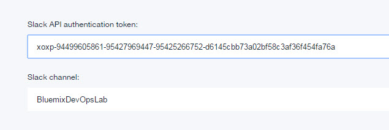
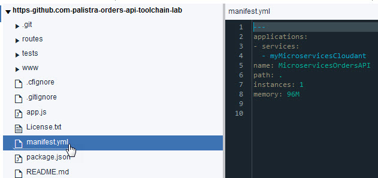
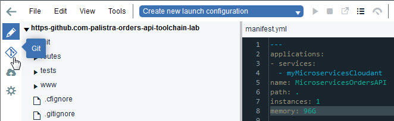
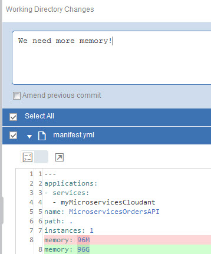
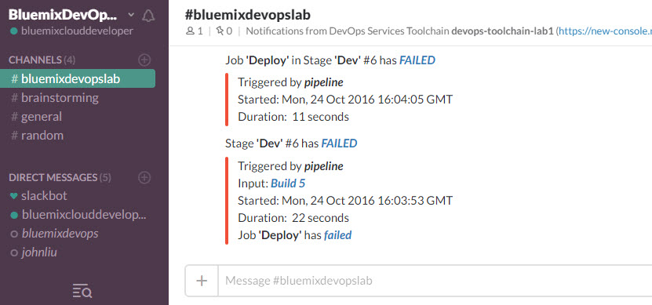
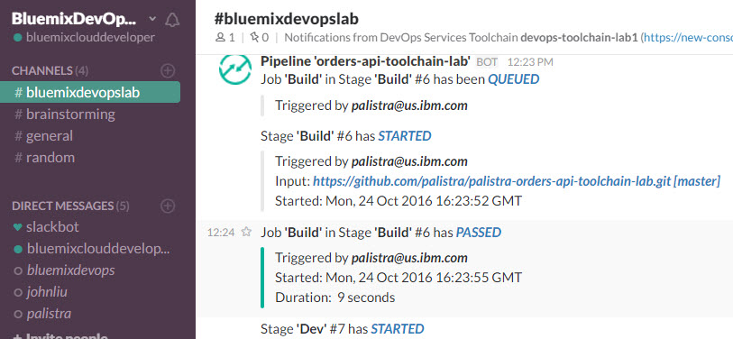

# Lab 5: Add Slack  Integration

# Objective
This lab show how to integrate your toolchain with Slack.  Slack provides real-time messaging for team communications. You can integrate Slack with your Bluemix DevOps Services project so that notifications about build results from your Build & Deploy pipeline are posted on a Slack channel.

**Tasks**:
- [Task 1: Log into Slack](#task-1-log-into-slack)
- [Task 2: Add Slack to Toolchain](#task-1-add-slack-to-toolchain)
- [Task 3: Add Eclipse Orion Web IDE to Toolchain](#task-3-add-eclipse-orion-web-ide-to-toolchain)
- [Task 4: Verify Slack works by breaking application build](#task-4-verify-slack-works-by-breaking-application-build)
- [Task 5: Fix application](#task-5-fix-application)

## Task 1: Log into Slack
1. Go to the [Slack login panel for BluemixDevOpsLab (https://bluemixdevopslab.slack.com)](https://bluemixdevopslab.slack.com).
2. If you have a Slack account, ask your lab instructor to add you to the BluemixDevOpsLab Slack team.  After they do, check the eMail account associated with that Slack account for the verification link and click that link to validate joining the BluemixDevOpsLab Slack team. Go to [Task 2: Add Slack to Toolchain](#task-2-add-slack-to-toolchain) (**Note**: IBM employees who have a @us.ibm.com ID can create an account on the BluemixDevOps Slack team by clicking the link https://bluemixdevopslab.slack.com/signup/.  You will need to access your IBM eMail account to confirm adding your account to the BluemixDevOpsLab Slack team).
3.  If you do not have a Slack account, you can:
    - Create a new Slack account and ask the lab instructor to add that account to the BluemixDevOpsLab Slack team.  You will need to access the eMail associated with the Slack account OR
    - Use an ID already created for this lab.  Enter **BluemixCloudDeveloper@gmail.com** as the eMail address and **devops4me** as the password.

## Task 2: Add Slack to Toolchain
1. On the devops-toolchain-lab toolchain's Tool Integrations page, click **Add a Tool**
2. Select **Slack**
3. On the Slack Configuration page:
   - Enter the following all as one string as the Slack webhook.
 
  **https://hooks.slack.com/services/**
   
  **T2SEPHTRB/B3XPS9JMV/CiJnw2Jg98WXYXXJ1tDMXMbK**
   
   - Enter **#bluemixdevopslab** as the Slack channel.
  

4. Click **Create Integration**

## Task 3: Add Eclipse Orion Web IDE to Toolchain
We want to modify the application and one way is to use the Web IDE.

If you already added the Eclipse Orion Web ID to the toolchain,go to the next Task (to break the application build).

1. On the toolchain's Tool Integrations page, click **Add a Tool**
2. Select **Eclipse Orion Web IDE**.
3. No configuration is needed. so click **Create Integration**.

## Task 4: Verify Slack works by breaking application build
  1. On the toolchain's Tool Integrations page, click the **Eclipse Orion Web IDE** tile. The GitHub repos are automatically loaded in your workspace. The Web IDE workspace is on the cloud.
  2. In the file navigator, expand the <i>githubuserid</i>orders-api-toolchain_lab repo (if needed).
  3. In the file directory, click manifest.yml to open the file.

  
  4. Update the value for memory to 96g. This setting intentionally increases your memory to exceed the quota for your org. Your changes are automatically saved.
  5. Now to Push the changes.  From the Eclipse Orion Web IDE menu, click the **Git** icon.

  

  6. In the Working Directory Changes section, which is in the upper-right corner of the window, make sure that the changed file is selected.  Enter a relevant comment.

  
  7. Click **Commit** to put the changes in the local master branch.
  8. Put these changes in the origin/master branch and click **Push**. Your changes are automatically built and deployed in the pipeline.
  9. Return to devops-toolchain-lab toolchain's Tool Integrations page and click the pipeline tile for the orders-api microservice to watch the stages run in response to your commit (you may have to manually start the Build if it does not start automatically).
  10. The Deploy fails.

  
  11. The Slack bluemixdevopslab channel displays the progress and failure:

  
  12. If you completed the PagerDuty lab successfully with a valid email account, that account will have an email.  The link in the email will allow you to view the incident on PagerDuty.

## Task 5: Fix application

Now to fix the application.
  1. On the toolchain's Tool Integrations page, click the **Eclipse Orion Web IDE** tile.
  2. In the file navigator, expand the orders-api-toolchain_name repo (if needed).
  3. In the file directory, click manifest.yml to open the file.
  4. Update the value for memory to 96m.
  5. Now to Push the changes.  From the Eclipse Orion Web IDE menu, click the **Git** icon.
  6. In the Working Directory Changes section, which is in the upper-right corner of the window, make sure that the changed file is selected.
  7. Click **Commit** to put the changes in the local master branch.
  8. Put these changes in the origin/master branch and click **Push**. Your changes are automatically built and deployed in the pipeline.
  9. Return to your toolchain's Tool Integrations page and click the pipeline tile for the orders-api microservice to watch the stages run in response to your commit (you may have to manually start the Build if it does not start automatically).
  10. The deploy is successful.  And all the downstream stages run afterwards.  And the Slack bluemixdevopslab channel displays the progress and success.

  
