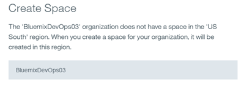
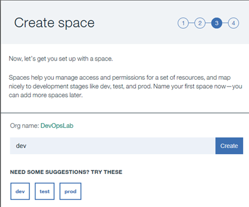
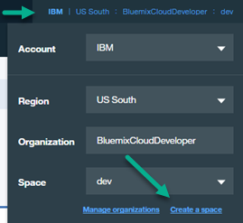
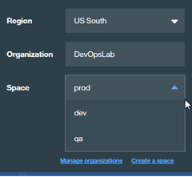

# Lab 0: Getting Setup

## Objective
This lab takes you through the various activities to prepare for the rest of the labs.

Prior to running these labs, you must have access to a lab laptop, an active Bluemix account, a GitHub account and Slack access. Your Bluemix account needs to have an appropriate organization and spaces. Follow the steps in Lab 0 to set these up. _Note:_ If you need to login to the virtual machine running on the lab laptop, the ID is `localuser` and the password is `passw0rd`.

**Tasks**:
- [Task 1: Create Bluemix trial account](#task-1-create-bluemix-account)
- [Task 2: Create Bluemix organization and spaces](#task-2-create-bluemix-organization-and-spaces)
- [Task 3: Create GitHub account](#task-3-create-github-account)
- [Task 4: Set up Slack access](#task-4-set-up-slack-access)

## Task 1: Create Bluemix trial account

1. If you already have an active Bluemix account, you can skip this task.
2. Open a web browser and enter the following URL: [https://console.ng.bluemix.net/](https://console.ng.bluemix.net/)
3. Click on the **Sign Up** button.
4. Follow the directions to fill out the form. Note you will need access to an eMail account to confirm the account setup activity. Make note of the password you specify.
5. Click **Create Account**. This will cause Bluemix to send an email to the eMail account you specified.
6. Login into the eMail account you specified. Open the eMail with the subject: _Action Required: Confirm your Bluemix account_.
7. Click on the **Confirm Account** button.
8. You now have an active Bluemix trial account.

## Task 2: Create Bluemix organization and spaces

1. Log in to Bluemix at: [https://console.ng.bluemix.net/](https://console.ng.bluemix.net/)
2. If this is your first time logging into this Bluemix account, You will be asked to enter an organization name. Ensure you are in the _US South_ region, pick one of the suggested defaults, such as your Bluemix ID or eMail address as the Organization name and click **Create**.

    If this is not your first time to log in to this Bluemix account, and this is a trial account, use the Organization you created when you first logged into this Bluemix account.

3. We will create three spaces (_dev_, _qa_ and _prod_) for use in this lab. If this is your first time logging into this Bluemix account, you will be prompted to create a space right after creating an Organization.  Enter **dev** as the space name and click **Create**.

   Click **I'm Ready**.
   If you are not prompted to create a space, create the _dev_ space when you create the _qa_ and _prod_ space below.

4. Click the upper-right hand corner environment settings and click on **Create a space**.
   
5. Enter **qa** as the space name and click **Create**.
6. Repeat the steps to create a space called **prod**.
6. If you have created all three spaces correctly, when you click the upper-right hand corner environment settings and click on the down-arrow for _Space_ you will see all three spaces.

## Task 3: Create GitHub account

1. If you already have a GitHub account, skip this task.
2. In a web browser, enter the following URL: [https://github.com/](https://github.com/).
3. Follow the directions to fill out the form. Note you will need access to an eMail account to confirm the account setup activity. Make note of the password you specify.
4. Click on the **Sign up for GitHub** button. This will cause GitHub to send an email to the eMail account you specified.
5. Login into the eMail account you specified. Open the eMail from GitHub with the subject: _Please verify your email address_.
6. Click on the **Verify email address** link.
8. You now have an active GitHub account.

## Task 4: Set up Slack access

There are a number of ways to access Slack.  One is through the web browser, another is through a desktop application and a third is through your mobile device.  The method used in these labs in web browser.  Feel free to install the desktop or mobile app if you prefer accessing Slack in that way.

1. In a web browser, open a new tab and go to the following URL to go to the (already created) Slack team.  You could create and administer your own Slack team if you would prefer, the instructions for doing so are not part of this exercise.  Additionally, you could also download and install the Slack app to your SmartPhone and access Slack that way.

   [https://bluemixdevopslab.slack.com](https://bluemixdevopslab.slack.com)

2. Enter the following information:
   1. Email address: **BluemixDevOps@gmail.com**
   2. Password: **bluemix4me**

    

   and click **Sign in**.

   Why don't we have you use your _own_ email address? If we did, the Slack team administrator would have to give that email address permission to access the team.  So if you want manage your own Slack team, you can do so, remembering to modify the Team name, channel, etc. for your Slack team.
3. Click on the **demolab_devops** channel to show the messages for that channel.

   

  This channel will show all the messages the Toolchain sends to it.

[comment]: # (**BluemixInterConnectDevOps@gmail.com**  **BluemixDevOpsDeveloper@gmail.com**)
[comment]: # (devops4me  bluemix4me)
[comment]: # (SignIntoSlackInterConnect  SignIntoSlackDevOps)
[comment]: # (interconnect_devops demolab_devops)
[comment]: # (SlackChannelInterConnect  SlackChannelDevOps)
