# Lab 2: Create Order Toolchain Using Pre-Built Template

## Objective
This lab creates a simple toolchain for the Orders API microservice and then examines it.  It assumes that a Bluemix organization and _dev_, _qa_ and _prod_ Spaces are already created.

**Tasks**:
- [Task 1: Log into IBM Bluemix](#task-1-log-into-ibm-bluemix)
- [Task 2: Create Toolchain](#task-2-create-toolchain)
- [Task 3: Explore Toolchain](#task-3-explore-toolchain)
- [Task 4: Explore the Delivery Pipeline](#task-3-delivery-pipeline)

## Task 1: Log into IBM Bluemix
1. If you are not already logged into IBM Bluemix, log into IBM Bluemix (https://www.ibm.com/cloud-computing/bluemix/).


## Task 2: Create Toolchain
1. We need to get to DevOps Services. Click on the **Bluemix menu bar** in the upper left corner.

and click on **Services** then **DevOps**.


2. Click on **Toolchains**.

3. Click on **Create a Toolchain**.


4. These are the Toolchain templates provided by Bluemix.  We could use one of those to start creating a Toolchain and customize the necessary information such as the current GitHub repo, Toolchain name, etc.

   Instead, a custom Toolchain template was created (from the provided _Simple Cloud Foundry toolchain_) and we will use this to create our first Toolchain. (This means you too could create custom templates for your enterprise!)

5. Enter the following into the web browser (this will get expanded):
[http://ibm.biz/DevOpsSimpleOrderToolchain](http://ibm.biz/DevOpsSimpleOrderToolchain)
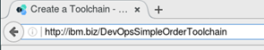

   and press *Enter*.

6. If you haven't authorized Bluemix to access GitHub, you need to:

      1. Click **Authorize** to go to the GitHub website.
      2. If prompted for credentials, enter your GitHub username and password. and click **Sign in**.
      4. Click **Authorize application**.

7. The input panel for the Toolchain creation is displayed.  A graphical representation of the Toolchain is at the top.  This Toolchain uses the GitHub repository to store and version code.  It includes the GitHub Issue tracker.  It has one Delivery Pipeline for building and deploying code and the application gets deployed to Bluemix.


8. The _Organization_ is pre-populated with the Organization we created earlier.  The _Toolchain Name_ is pre-populated with the name specified in the Toolchain template and a timestamp appended to keep the Toolchain Name and associated artifacts unique.  An enterprise might rename the Toolchain and associated artifacts to something more meaningful, but we will leave it as is.  These instructions will not use a specific timestamp as the timestamp will be unique.  All the fields and field values are specified in the Toolchain template.
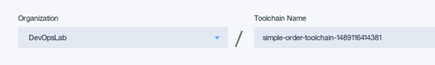

9. The next section displays the configuration for the Tool Integrations.  The blue box surrounds and highlights the tool for which integration information is displayed, initially GitHub.


10. The next section has details about the GitHub repo.  It will be cloned to the _New repository name_ from the _Source repository URL_ so we can make changes without impacting anyone else. The _New repository name_ will be created for the GitHub user we created.


11. Click on _Eclipse Orion Web IDE_. No information is needed to integrate this browser based Integrated Development Environment (IDE).
12. Click on _Delivery Pipeline_. This displays the configuration information for the Delivery Pipeline. The application name to be deployed is the _App name_. This pipeline only has one Stage or set of jobs.  We will see what gets specified there later.  This Stage will deploy the _Orders app name_ to the specified Region (US South), Organization, and Space (dev).
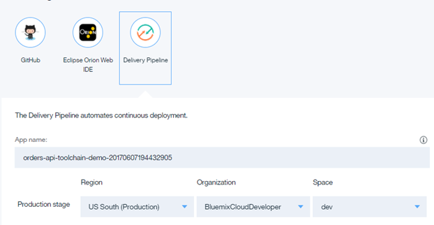

12. Use the drop down arrow for space to specify _prod_.
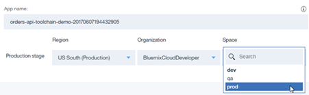

13. Click **Create**.  Your Toolchain is created and you are redirected to the Toolchain panel.


## Task 3: Explore Toolchain

1. IBM Bluemix created the Continuous Delivery Toolchain based on the customized simple template.  At the top you see the pieces of the [Bluemix Garage Method](https://www.ibm.com/devops/method/) and where each tool integration fits.


2. **Think** is where the [GitHub](https://github.com/) Issues database is listed.  Click on the **orders-api-toolchain-demo-<i>timestamp</i>** link (or right-mouse button click and select **Open Link in New Tab**, then select the new tab to save time later on).


3. This displays the **GitHub Issues** page.  Issues are used to track todos, bugs, feature requests, and more.  Each GitHub repository (_repo_ for short) can include issues.

Return to the Toolchain by either clicking on the **Go back one page** arrow on the browser or, if you clicked the right-mouse button to open a new browser tab, close the GitHub Issues browser tab. (Note that the remainder of these lab instructions may not go into this level of detail on opening and closing pages and tabs - pick the method that is best for you.)

4. **Code** is where [GitHub](https://github.com/) code repos and Eclipse Orion Web IDE are integrated.
      1. Clicking on the repo
      
      will display the respective (cloned) repo
      
      The creation of the Toolchain did clone the repo in GitHub.
      Return to the Toolchain page by either clicking on the **Go back one page** arrow on the browser or, if you clicked the right-mouse button to open a new browser tab, close the GitHub Issues browser tab.

      2. Clicking on the **Eclipse Orion Web IDE** will display the Web editor.
      

      3. Return to the Toolchain by clicking on the Bluemix back arrow.
      

5. **Deliver** is where the code gets built, tested and deployed through the integrations of build pipelines. We look at those in the next task.

## Task 4: Explore the Delivery Pipeline
1.  Click on the circle in the center of the _orders-api-toolchain-demo-<i>timestamp</i>_ Delivery Pipeline tile.

to display the Orders API Delivery Pipeline.


2. While we were busy exploring the toolchain, Bluemix started to execute the just created Delivery Pipeline.  A _Delivery Pipeline_ consists of one or more _Stages_. Stages organize input and jobs as your code is built, deployed, and tested. Stages accept input from either source control repositories (SCM repositories such as GitHub) or build jobs (build artifacts) in other stages. When you create your first stage, the default settings are set for you on the _INPUT_ tab for the stage.

   By default in a stage, builds and deployments are run automatically every time changes are delivered to a project's SCM repository. Stages and jobs run serially and enable flow control for your work. For example, you might place a test stage before a deployment stage. If the tests in the test stage fail, the deployment stage won't run.

   Stages consist of one or more _Jobs_.  A job is an execution unit within a stage. Jobs in a stage run sequentially. By default, if a job fails, subsequent jobs in the stage do not run.

   Before a job is run, its working directory is populated with input defined at the stage level. For example, you might have a stage that contains a test job and a deploy job. If you install dependencies on one job, they are not available to the other job. However, if you make the dependencies available in the stage's input, they are available to both jobs.

   Except for Simple-type build jobs, when you configure a job, you can include UNIX shell scripts that include build, test, or deployment commands. Because jobs are run in ad hoc containers, the actions of one job cannot affect the run environments of other jobs, even if those jobs are part of the same stage.

   The delivery pipeline displays the status of each stage in the pipeline.  Depending on how fast you went through the steps after the Toolchain was created, you may have to wait a moment or two for the _DEPLOY_ stage to complete.
   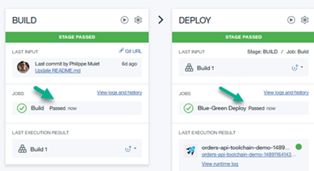

   The **BUILD** and **DEPLOY** stage passed.
3. The _BUILD_ stage in this case is simply cloning the repo.
4. In the _DEPLOY_ stage, click the gear icon and then **Configure Stage** to configure the stage.


5. By default, the JOBS view is displayed. The _INPUT_ tab displays the input to the stage, the _JOBS_ tab displays the discrete jobs of the stage, and the _ENVIRONMENT PROPERTIES_ tab displays variables used by the jobs in the stage.
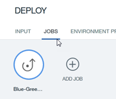

6. There is only one job in this stage, the job named _Blue-Green Deploy_. Scrolling down you see the _Deployer Type_ (Cloud Foundry), _Target_ region (US South), _Organization_, _Space_ (prod) and the deployed _Application Name_ (orders-api-toolchain-demo-<i>timestamp</i>).
7. Look at the _Deploy Script_. This script does a _Blue-green_ deployment. A blue-green deployment is a release technique reducing downtime and risk by running two identical production environments called Blue and Green. At any time, only one of the environments is live, with the live environment serving all production traffic.
8. The first section put a comment into the log file and then issue the Cloud Foundry (_cf_ command to create the service _cloudantNoSQLDB_.  It the service already exists, the script simply continues.
   ```
   echo "Attempting to create cloudantNoSQLDB Lite myMicroservicesCloudant for use by the microservices. It is not a problem if it already exists, we simply continue."
   cf create-service cloudantNoSQLDB Lite myMicroservicesCloudant
   ```
9. The next section of the script echos a comment to the log and then issues the cf (Cloud Foundry) _app_ command for the application (_$CF_APP_) we want to deploy.  If the application is not found (for example if this is the first time the application is being deployed), the _app_ command fails, at which point the Cloud Foundry _push_ command is used to deploy the _$CF_APP_.
   ```
   # Push app
   echo "If the $CF_APP does not exist, push the app."
   if ! cf app $CF_APP; then
     cf push $CF_APP
   ```
0. The next section, which gets executed if the application is already deployed, defines how to undo what we are about to try in case of error.
   ```
   else
     OLD_CF_APP=${CF_APP}-OLD-$(date +"%s")
     rollback() {
       set +e
       if cf app $OLD_CF_APP; then
         cf logs $CF_APP --recent
         cf delete $CF_APP -f
         cf rename $OLD_CF_APP $CF_APP
       fi
       exit 1
     }
   ```
1. The next section renames the deployed application (_$CF_APP_) to a temporary name (_$OLD_CF_APP_), issues the cf (Cloud Foundry) _push_ command to deploy the new version and if the cf _push_ is successful, deletes the old version using the cf _delete_ command.
   ```
   set -e
   trap rollback ERR
   echo "If the $CF_APP does exist, rename it."
   cf rename $CF_APP $OLD_CF_APP
   echo "And push out the new version."
   cf push $CF_APP
   echo "If the push is successful, delete the old app."
   cf delete $OLD_CF_APP -f
   ```
2. The final section exports the application name and URL so other jobs in the Pipeline can use it.
   ```
   # Export app name and URL for use in later Pipeline jobs
   export CF_APP_NAME="$CF_APP"
   export APP_URL=http://$(cf app $CF_APP_NAME | grep urls: | awk '{print $2}')
   # View logs
   #cf logs "${CF_APP}" --recent
   ```
3. Under the Deploy Script window is the option to stop the stage if this job fails, selected for this job.


4. Click on ENVIRONMENT PROPERTIES to see the user-defined environment properties used to share information in the Pipeline.  There are also a number of pre-defined Environment Properties.  For example, the _CF_APP_ property is pre-defined and for deployments is the name of the app to deploy. This property is required for deployment and can be specified in the script itself, the deploy job configuration interface, or the project's manifest.yml file.
5. Click the left arrow to the left of _Pipeline_ to return to the Delivery Pipeline.
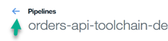
6. In the **DEPLOY** stage, click **View logs and history** to display the commands and results of the stage.

5. If you scroll through the log, you can see the details of the job execution.  Note that the __myMicroservicesCloudant_ service was created.
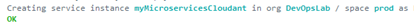
6. Then the existence of the deployed app _orders-api-toolchain-demo-<i>timestamp</i>_ is checked for.  As it does not exist, there is no need to rename it.  Just deploy it.
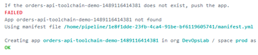
7. Scroll past the all the necessary runtime packages to get to the bottom of the log, showing the application starting and the URL to access the application.

8. Click the left arrow to the left of _Pipeline_ to return to the Delivery Pipeline.
9. Click the application URL to display the application.

0. The application is displayed in a new browser tab.
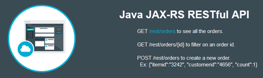
1. Close the browser tab displaying the application.
2. On the _DEPLOY_ stage click the **Run Stage** arrow to run the stage again.
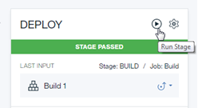
3. When the stage completes, view the log.
4. Note the __myMicroservicesCloudant_ service already existed so there is no need to create it.

5. Then the existence of the deployed app _orders-api-toolchain-demo-<i>timestamp</i>_ is checked for.  This time it does exist as Cloud Foundry returns information about it.

6. Since the application does exist, rename it and push out the new version of the application.
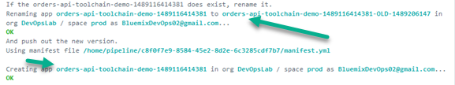
7. Scroll to the bottom where, after the new version of the application is deployed, the old (and renamed) version is deleted.

8. Click the left arrow to the left of _Pipelines_ to return to the Delivery Pipeline.
9. Click **Toolchains** to return to the _Toolchains_ page.
