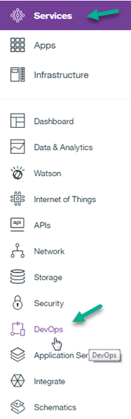
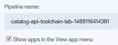
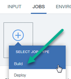
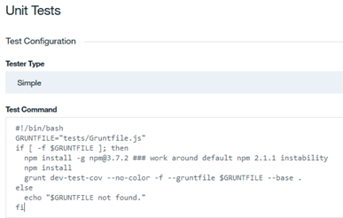
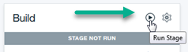
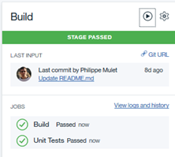
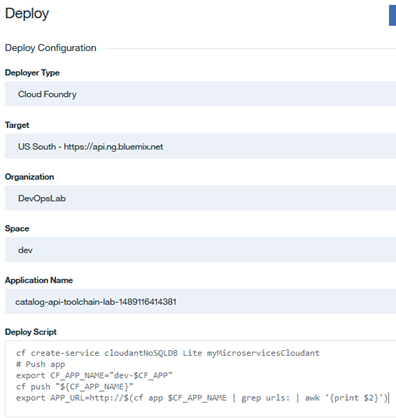
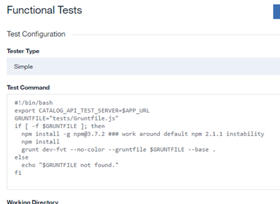
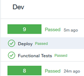
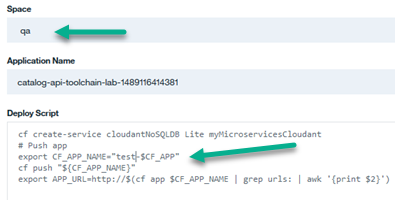

# Lab 3: Create Catalog Toolchain by Hand

## Objective
This lab manually creates a simple toolchain for the Catalog API microservice and then configures it.  It assumes that a Bluemix Organization and _dev_, _qa_ and _prod_ Spaces are already created.

**Tasks**:
- [Task 1: Create Toolchain](#task-1-create-toolchain)
- [Task 2: Add and Configure GitHub Integration](#task-2-add-and-configure-github-integration)
- [Task 3: Add Eclipse Orion Web IDE to Toolchain](#task-3-add-eclipse-orion-web-ide-to-toolchain)
- [Task 4: Add Catalog Delivery Pipeline](#task-4-add-catalog-delivery-pipeline)
- [Task 5: Add Build stage to Catalog Delivery Pipeline](#task-5-add-build-stage-to-catalog-delivery-pipeline)
- [Task 6: Add Dev stage to Catalog Delivery Pipeline](#task-6-add-dev-stage-to-catalog-delivery-pipeline)
- [Task 7: Add Test stage to Catalog Delivery Pipeline](#task-7-add-test-stage-to-catalog-delivery-pipeline)
- [Task 8: Add Prod stage to Catalog Delivery Pipeline](#task-8-add-prod-stage-to-catalog-delivery-pipeline)

## Task 1: Create Toolchain
Throughout the lab, the phrase _timestamp_ is used to indicate the same timestamp string that was appended to _simple-order-toolchain_.  While a timestamp string is not required, it does help make the name of the created objects unique.

1. If you are not already logged into IBM Bluemix, log into IBM Bluemix (https://www.ibm.com/cloud-computing/bluemix/).


1. If you don't see a button called _Create a Toolchain_, you need to get to DevOps Services. Click on the **Bluemix menu bar** in the upper left corner.

and click on **Services** then **DevOps**

and click on **Toolchains**.
2. Click **Create a Toolchain**.
3. Click on **Build your own toolchain**.
4. Change the _Toolchain Name_ from _empty-toolchain-timestamp_ to **catalog-toolchain-_timestamp_**.

5. Click **Create** to create the Toolchain.
6. The (empty) _catalog-toolchain-<i>timestamp</i>_ is displayed.

## Task 2: Add and Configure GitHub Integration
The code for the Catalog microservice already exists in a GitHub repository (https://github.com/open-toolchain/Microservices_CatalogAPI).  We will clone this repository and link to the clone.

1. Click on **Add a Tool** on the right side of the screen to add a Tool Integration.
2. Click on **GitHub** to add integration with GitHub to the Toolchain.
3. Select _Clone_ as the Repository type.
4. Enter **catalog-api-toolchain-lab-_timestamp_** for the _New Repository Name_.
5. Enter _https://github.com/open-toolchain/Microservices_CatalogAPI_ for the Source repository URL.

6. Click on **Create Integration**.  The integration is created.


## Task 3: Add Eclipse Orion Web IDE to Toolchain

If we want to modify the application, one convenient way is to use the Eclipse Orion Web IDE.

1. On the _catalog-toolchain-<i>timestamp</i>_ toolchain's Tool Integrations page, click **Add a Tool**
2. Click **Eclipse Orion Web IDE**.
3. No configuration is needed, so click **Create Integration**.

## Task 4: Add Catalog Delivery Pipeline

Now that you have a Git repository clone of the code, we will add a _Delivery Pipeline_ to deploy and test the application.

1. Click on **Add a Tool** on the right side of the screen to add a Tool Integration.
2. Click on **Delivery Pipeline** to create a new Delivery Pipeline (we will add Stages and Jobs to this).
3. For 'Pipeline name:', enter "<b>catalog-api-toolchain-lab-<i>timestamp</i></b>" and ensure 'Show apps in the VIEW APP menu' checkbox is checked.

4. Click **Create Integration**.
5. The _catalog-api-toolchain-lab-<i>timestamp</i>_ Delivery Pipeline is created.

## Task 5: Add Build stage to Catalog Delivery Pipeline

Now to configure the _catalog-api-toolchain-lab-<i>timestamp</i>_ Delivery Pipeline. We will make this pipeline a little more complex.  We will add four stages: Build, Dev, Test and Prod.

- The **Build** stage has two jobs, performing the initial build of the code from the GitHub Repository then some unit tests.
- The **Dev** stage has two jobs, taking the output from the Build stage and deploying on Bluemix into the _dev_ space, then performing automated functional tests.
- The **Test** stage has two jobs, taking the output from the Dev stage and deploying on Bluemix into the _qa_ space, then performing automated tests.
- The **Prod** stage has one job, taking the output from the Test stage and deploying on Bluemix into the _prod_ space.  This stage will perform a Blue-Green deployment, checking to see there is an earlier instance of this application running and if it is, keep it around in case the deploy of the new version of the app has problems.  If the new version deploys successfully, the old version is deleted.  If not, the new version is deleted and the old version continues to run.

1. Click on the **Delivery Pipeline** tile for the catalog-api-toolchain-lab delivery pipeline.
2. Click **Add Stage**.
3. This is the _INPUT_ portion of the stage. Note that the _Input Type_ is set to Git Repository_ and the _Git Repository_,  _Git URL_ and (Git) _Branch_ are pre-filled.  Also, _Stage Trigger_ is set to "Run jobs whenever a change is pushed to Git", resulting in this stage running when Git is updated.
4. Rename the stage from _MyStage_ to **Build**.
5. Click the _JOBS_ tab so we can add some jobs.

7. Click the **+** and select **Build** for the JOB TYPE.

On the Build configuration panel, note that:

   - The job name is _Build_ (just like the stage name.)
   - _Builder Type_ is set to "Simple" (other options are available on the pull-down).
   - _Run Conditions_ is set to "Stop running this stage if this job fails" to prevent any other jobs in this stage from running and to mark the stage failed if this Job fails.
8. Click **ADD JOB**, this time selecting **Test** for the JOB TYPE.
9. Rename the job from _Test_ to _Unit Tests_.
0. Enter the following for the _Test Command_.  _Note:_ You can enter the following URL into another browser tab to display the code for easy copy and pasting: [http://ibm.biz/CatalogAPIDevUnitTest](http://ibm.biz/CatalogAPIDevUnitTest)
   ```
   #!/bin/bash
   GRUNTFILE="tests/Gruntfile.js"
   if [ -f $GRUNTFILE ]; then
     npm install -g npm@3.7.2 ### work around default npm 2.1.1 instability
     npm install
     grunt dev-test-cov --no-color -f --gruntfile $GRUNTFILE --base .
   else
     echo "$GRUNTFILE not found."
   fi
   ```
   This script checks to see if the file _tests/Gruntfile.js_ exists.  If it does, we install a version of npm then run an automated Grunt tests.  If the file _tests/Gruntfile.js_ does not exist, simple echo a line into the log file.

1. Click **Save** to save the _Build_ stage.
2. The _Delivery Pipeline_ displays the **Build** stage.  This stage has not been run. Click on the **Run Stage** icon to run the build.

3. The JOBS section shows the Build (job) progress.  After a few moments, the **Build** stage has been successfully executed.

4. Click _View logs and history_ for the jobs to examine the logs for each job.  When done, return to the Delivery Pipeline.

## Task 6: Add Dev stage to Catalog Delivery Pipeline

Now we add the _Dev_ stage and jobs.  The _Dev_ stage has two jobs.  The first job deploys the just built Catalog API microservice and deploys it into the _dev_ space on Bluemix and the second job performs some automated tests on the deployed microservice.

1. Click on **ADD STAGE**.
2. Name the stage **Dev**.  Note that:

- _Input Type_ is set to Build Artifacts (from the **Build** stage).
- _Stage_ and _Job_ are both _Build_.
- _Stage Trigger_ is set to "Run jobs when the previous stage is completed", resulting in the Dev stage running when the **Build** stage successfully completes.
3. Click the **JOBS** tab and add a new job of type **Deploy**.  Note that:

- _Deployer Type_ is set to "Cloud Foundry" (other options are available on the pull-down).
- _Target_ is set to "US South - https://api.ng/bluemix.net" as this is where the code will be deployed.
- _Space_ is set to "dev".
- _Application Name_ is "catalog-api-toolchain-lab-<i>timestamp</i>".
3. Type the following into the _Deploy Script_ section.  This script first creates the cloudantNoSQLDB (remember, if it already exists, the script simply continues).  Then the variable _CF_APP_NAME_ is set to the application name (_catalog-api-toolchain-lab-<i>timestamp</i>_) has the space name _dev_ added to the front of the name.  This keeps the name unique as we will deploy this application to the _qa_ and _prod_ space later.  _Note:_ You can enter the following URL into another browser tab to display the code for easy copy and pasting: [http://ibm.biz/CatalogAPIDevDeploy](http://ibm.biz/CatalogAPIDevDeploy)
   ```
   cf create-service cloudantNoSQLDB Lite myMicroservicesCloudant
   # Push app
   export CF_APP_NAME="dev-$CF_APP"
   cf push "${CF_APP_NAME}"
   export APP_URL=http://$(cf app $CF_APP_NAME | grep urls: | awk '{print $2}')
   ```
   
5. The bash script just entered into the Deploy Script references both the _CF_APP_NAME_ and _APP_URL_ environment variables (remember, _CF_APP_ is provided by default).  These two environment variables are used to pass information between jobs in this stage and need to be added to the environment variables as Text.
6. Click the **ENVIRONMENT PROPERTIES** tab.
7. Click **ADD PROPERTY** and select **Text Property**.
8. Enter **CF_APP_NAME** as the 'Name'.  Do not enter anything for the 'Value'.
9. Click **ADD PROPERTY** and select **Text Property**.
0. Enter **APP_URL** as the 'Name'.  Do not enter anything for the 'Value'.

1. Click the **JOBS** tab and add a new job of type **Test**.
2. Change the jobs name from _Tests_ to **Functional Tests**.
3. Note that the _Tester Type_ is _Simple_.
4. Enter the following code to the  _Test Command_ section.  _Note:_ You can enter the following URL into another browser tab to display the code for easy copy and pasting: [http://ibm.biz/CatalogAPIDevFVT](http://ibm.biz/CatalogAPIDevFVT)
   ```
   #!/bin/bash
   export CATALOG_API_TEST_SERVER=$APP_URL
   GRUNTFILE="tests/Gruntfile.js"
   if [ -f $GRUNTFILE ]; then
     npm install -g npm@3.7.2 ### work around default npm 2.1.1 instability
     npm install
     grunt dev-fvt --no-color --gruntfile $GRUNTFILE --base .
   else
     echo "$GRUNTFILE not found."
   fi
   ```
   This bash shell runs the same functional test scripts on the catalog service but this time against the deployed application in the _dev_ space.
   
5. Click **Save** to save the _Dev_ stage.
6. The _Delivery Pipeline_ displays the _Build_ and _Dev_ stages.  The _Dev_ stage has not been run. Click on the **Run Stage** icon (the right arrow in the _Dev_ stage) to run the _Dev_ stage, deploying the Catalog application to the _dev_ space and executing the functional tests.
7. The _JOBS_ section shows the Stage was successful. Click on "View logs and history" to the Stage history.
8. Stage History displays the execution history of the stage in reverse chronological order (so the most recent on top and the oldest at the bottom).  Within the history of a stage execution, the job history is displayed in the order in which the job was attempted.  For example, the following screen shot shows that this stage was executed twice.  Within the most recent execution (_9_), the _Deploy_ job was attempted (and passed) followed by the _Functional Tests_ job (which also passed). Your screen will probably just have **1** attempt.

1. This display shows that the _Dev_ stage ran both jobs and they both passed.  Initially, the log for the _Deploy_ job is displayed. Scrolling to the bottom and you see the application was deployed as _catalog-api-toolchain-lab-<i>timestamp</i>_ into the _dev_ space.

0. Scroll back to the top and click the **Test** job to display the log for it.  Scroll to the bottom.

1. Return to the Delivery Pipeline.

## Task 7: Add Test stage to Catalog Delivery Pipeline

Now we add the _Test_ stage and associated jobs.  The _Test_ stage has two jobs.  The first job deploys the just built Catalog API microservice and deploys it into the _qa_ space on Bluemix and the second job performs some automated tests on the deployed microservice.  This time, we will clone the _Dev_ stage and make some modifications.

1. On the _Dev_ stage, click the _Configure Stage_ gear icon and select **Clone Stage**.

2. Rename the cloned stage to **Test** from _Dev [copy]_.
3. On the _Jobs_ tab, for the _Deploy_ job, change the space to **qa** from _dev_..
4. Change the _Deploy_ deploy script so CF_APP_NAME gets set to **"test-$CF_APP"** from _"dev-$CF_APP"_.

5. Switch to the _Functional Test_ job.
6. Change the _Test Command_ to:
   ```
   #!/bin/bash
   # invoke tests here
   echo "Testing of App Name ${CF_APP_NAME} was successful"
   ```
   This 'test' script just echos the app name to the console log.  In a real environment, we would execute automated test tools and scripts to validate the deployed service still worked.
7. Click **Save** to save the _Test_ stage.
8. The Delivery Pipeline displays the _Build_, _Dev_ and _Test_ stages.  The _Test_ stage has not been run. Click on the **Run Stage** icon to run the _Test_ stage and deploy the order API to the _test_ space.
9. As before for the _Dev_ stage, the **JOBS** section of the _Test_ stage shows the _Deploy_ and _Functional Tests_ jobs were successful. Click **Functional Tests** to display the log for the _Functional Tests_ job. Notice the "Testing of App Name" message was echoed to the log.
0. Return to the Delivery Pipeline.  Click on the application URL (http://test-catalog-api-toolchain-lab-<i>timestamp</i>.mybluemix.net/) to access the running application.  Note that _test-_ was added to the start of the application name.
1. Close the application browser window.
2. On the Delivery Pipeline display, click on the **View runtime log** link to examine the log for this runtime.  Return to the Delivery Pipeline.
3. The **Test** stage has been successfully added and executed.

## Task 8: Add Prod stage to Catalog Delivery Pipeline

Now we will add the final stage to the Delivery Pipeline, the _Prod_ stage.  This stage has one job, which performs a _Blue-green_ deployment to the _prod_ space. As you may remember from the simple Order lab, a blue-green deployment is a release technique reducing downtime and risk by running two identical production environments called Blue and Green. At any time, only one of the environments is live, with the live environment serving all production traffic.

So during deployment, this stage will check to see there is an earlier instance of this application running and if it is, keep it around in case the deploy of the new version of the app has problems.  If the new version deploys successfully, the old version is deleted.  If not, the new version is deleted and the old version continues to run.  To do this, we will clone the _Dev_ stage and make some modifications.

1. Ensure the catalog-api-toolchain-lab _catalog-api-toolchain-lab-<i>timestamp</i>_ Delivery Pipeline is displayed.
2. Clone the _Dev_ stage.
3. Rename the cloned stage to **Prod** (from _Dev [copy]_).
4. On the _Jobs_ tab, change the Deploy Job name to **Blue/Green Deploy** and change the space from _dev_ to **prod**
5. Change the deploy script to the following _HINT_: It is very similar to the script we used for the Order Pipeline lab, perhaps you configure that Job to copy and paste the deploy script _or_ you can enter the following URL into another browser tab to display the code for easy copy and pasting: [http://ibm.biz/CatalogAPIProdBlueGreenDeploy](http://ibm.biz/CatalogAPIProdBlueGreenDeploy)
   ```
   #!/bin/bash
   echo "Attempting to create cloudantNoSQLDB Lite myMicroservicesCloudant for use by the microservices. It is not a problem if it already exists, we simply continue."
   cf create-service cloudantNoSQLDB Lite myMicroservicesCloudant
   export CF_APP_NAME="prod-$CF_APP"
   # Push app
   echo "If the $CF_APP_NAME does not exist, push the app."
   if ! cf app $CF_APP_NAME; then
     cf push $CF_APP_NAME
   else
     OLD_CF_APP_NAME=${CF_APP_NAME}-OLD-$(date +"%s")
     rollback() {
       set +e
       if cf app $OLD_CF_APP_NAME; then
         cf logs $CF_APP_NAME --recent
         cf delete $CF_APP_NAME -f
         cf rename $OLD_CF_APP_NAME $CF_APP_NAME
       fi
       exit 1
     }
     set -e
     trap rollback ERR
     echo "If the $CF_APP_NAME does exist, rename it."
     cf rename $CF_APP_NAME $OLD_CF_APP_NAME
     echo "And push out the new version."
     cf push $CF_APP_NAME
     echo "If the push is successful, delete the old app."
     cf delete $OLD_CF_APP_NAME -f
   fi
   # Export app name and URL for use in later Pipeline jobs
   # export CF_APP_NAME="$CF_APP"
   export APP_URL=http://$(cf app $CF_APP_NAME | grep urls: | awk '{print $2}')
   # View logs
   #cf logs "${CF_APP}" --recent
   ```
6. Click **Save** to save the _Prod_ stage.
7. Click on **Run Stage** to run the _Prod_ stage and deploy the Catalog API app to _prod_ space.
8. The JOBS section of the _Blue/Green Deploy_ shows the Deploy was successful. Inspect the _Blue/Green Deploy_ Job log to see where the app was deployed and the _Functional Tests_ Job log to ensure the tests were successful.
9. Return to the Delivery Pipeline.
0. Click the application URL in the _Prod_ stage to access the running application.  Note that _prod-_ was added to the start of the application name.  Where was that changed?
1. Close the application browser window.  The **Prod** stage has been successfully added and executed, deploying the application to the _prod_ space.
2. Click on the left arrow to the left of _Toolchain_ to return to the _catalog-toolchain-<i>timestamp</i> page.
3. Click on the left arrow to the left of _Toolchains_ to return to the _Toolchains</i> page.
