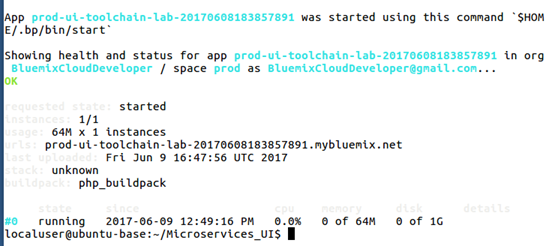
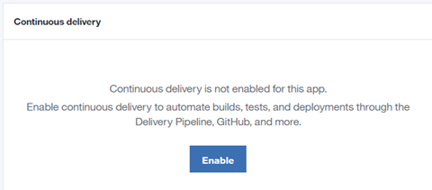
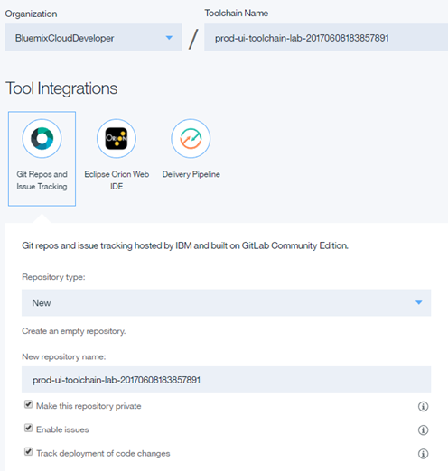
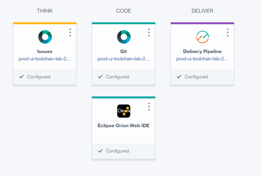
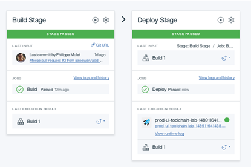
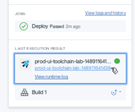
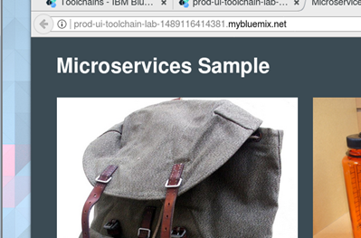

# Lab 4: Create UI Toolchain from Deployed App

## Objective
This lab manually deploys the UI microservice, creates a simple Toolchain from the deployed application and then configures the Toolchain.  It assumes that the _DevOpsLabs_ Organization and _dev_, _qa_ and _prod_ Spaces are already created.

**Tasks**:
- [Task 1: Deploy UI Application](#task-1-deploy-ui-application)
- [Task 2: Create Toolchain](#task-2-create-toolchain)
- [Task 3: Build Application](#task-3-build-application)

Throughout the lab, the phrase _timestamp_ is used to indicate the same timestamp string that was appended to _simple-order-toolchain_.  While a timestamp string is not required, it does help make the name of the created objects unique.

## Task 1: Deploy UI Application
1. If you are not already logged into IBM Bluemix, log into IBM Bluemix (https://www.ibm.com/cloud-computing/bluemix/).

3. If you are using the Ubuntu VMware image, open a terminal Window by selecting **Terminal** from the Launcher.

If you are using your own machine, open up a command prompt.
4. The sample code that you will be using is in a github repository. We will clone (make a copy) onto our local machine, In a terminal  window, enter the following command:
`git clone https://github.com/open-toolchain/Microservices_UI`
5. Change into the just created directory.
`cd Microservices_UI`
6. If you are curious, you can enter the ls command to see the files.
7. Login to Bluemix from the command line by entering the following command:
`bx login -a https://api.ng.bluemix.net -u userid@domain.com -o _org_name_ -s prod`
8. Push the application to Bluemix with the following command:
`bx app push prod-ui-toolchain-lab-<i>timestamp</i>`

## Task 2: Create Toolchain

1. Return to the Bluemix console.
2. If you are not on the Toolchains page (if you don't see a button called _Create a Toolchain_), click on the **Bluemix menu bar** in the upper left corner.

and click on **Services** then **DevOps**

and click on **Toolchains**.
2. Click **Create a Toolchain**.
3. Click on the link **Create a toolchain from an application**.  It is on the left of the screen.
4. If the _prod_ space is not displayed in the upper right hand corner, click the upper-right hand corner account settings and select **prod** as the _Space_.

5. Click on the application to display the application dashboard.
6. Click on your (just created) application to display the application overview page.

7. Click on the **Enable** button for _Continuous Delivery_.

8. The Continuous Delivery Toolchain creation page is displayed and pre-filled with information about the application.

9. We need to clone the Git repo (remember, earlier from the command line we created a local cloned copy on the local machine).  The pre-built integration is to _Git Repos and Issue Tracking_, the IBM hosted repos and issue tracking based on GitLab.
0. Change _Repository type:_ to **Clone**.
1. Enter **https://github.com/open-toolchain/Microservices_UI** as the _Source repository URL_.
9. Click **Create**.  The Toolchain is created.

Note the _Issues_ and _Git_ icons are different then before as _Git Repos and Issue Tracking_ is being used.

## Task 3: Build Application

1. On the Bluemix _Create a Toolchain_ page, click the blue arrow to the left of _Toolchains_ to return to the Toolchains.
2. Click the just created Toolchain _(prod-ui-toolchain-lab-<i>timestamp</i>)_.
2. Click on the _Delivery Pipeline_ tile.
3. Run the _Build Stage_.
4. The _Build_ and _Deploy_ stages complete (the _Deploy Stage_ was started as a result of the _Build Stage_ completing successfully).

5. Click on the application URL.

6. Assuming the microservices names match up, the application works.  If not, don't worry, somewhere along the way the <b><i>timestamp</i></b> may have been mistyped.

7. Close the application tab.
8. If you wish, you can add more jobs or stages.
9. On the _(prod-ui-toolchain-lab-<i>timestamp</i>)_ page, click the blue arrow to the left of _Toolchains_ to return to the Toolchains.
