# Integrate Bluemix Availability Monitoring

## Objective

This lab integrates Bluemix Availability Monitoring into the Continuous Delivery Toolchain. [Bluemix Availability Monitoring](https://console.ng.bluemix.net/docs/services/AvailabilityMonitoring/index.html) helps DevOps teams ensure their applications are always available and meeting user expectations for response time as they roll out continuous updates. The service, which is tightly integrated into the DevOps toolchain, runs synthetic tests from locations around the world, around the clock to proactively detect and fix performance issues before they impact users.

## Tasks
- [Task 1: Integrate Bluemix Availability Monitoring](#task-1-integrate-bluemix-availability monitoring)
- [Task 2: Work with Bluemix Availability Monitoring](#task-2-work-with-bluemix-availability monitoring)

## Task 1 Integrate Bluemix Availability Monitoring

1. Make sure your toolchain is displayed and click **Add a Tool** in the upper right corner.
2. Click **Availability Monitoring** from the list of Tool integrations.

3. Notice that this tool does not require configuration, so click **Create Integration** to add it to your toolchain. It is added under the **Manage** phase, and indicates that it is configured. You also receive a notification in the Slack channel that the service has been bound to the toolchain.  

## Task 2: Work with Bluemix Availability Monitoring

1. From the toolchain, click **Availability Monitoring**. A list of the apps that are bound to the service is displayed. Only one is listed as there is only one in the Toolchain, running in the _prod_ space.
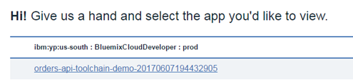
2. Select the monitored Apps to display the Availability monitoring information for that app. Because it hasn't been running long, there is no information to see yet.
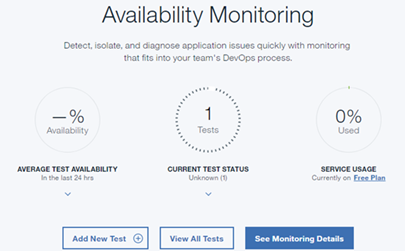
3. By default a single test is configured. The main application URL is monitored by default. Any other URLs and services that you monitor can be inside or outside of Bluemix and do not need to be related to the associated Cloud Foundry application. Click the arrow beneath the circle that is labeled **1 Tests**, then click the test card to display the breakdown.
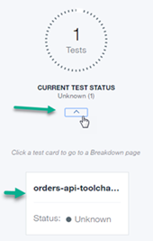
4. This page displays a summary of the tests that have been run in the last 24 hours. You see a test summary at the top, including average response time, historical trends, and current status. This page also shows the details for each of the tests that have been run from 3 default locations, as well as response time and availability information from each of the locations.

5. Scroll down to the graph that shows response time. Response times for each of the 3 locations is displayed in the graph.    It appears response time is quicker from Dallas than from London or Melbourne.  Why is that?
6. Click **Expand** next to both _Melbourne_ and _Dallas_.
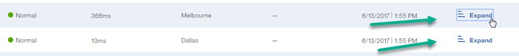
7. Compare the Melbourne response times:
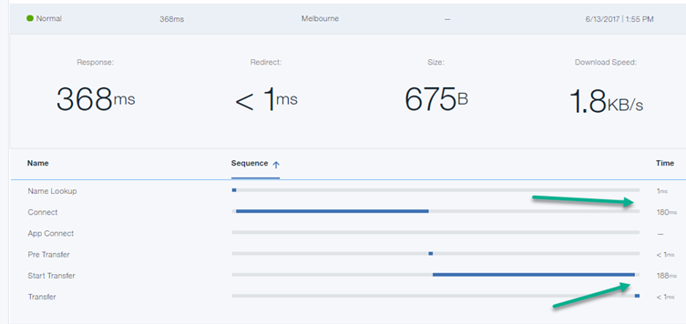
to the Dallas response times:
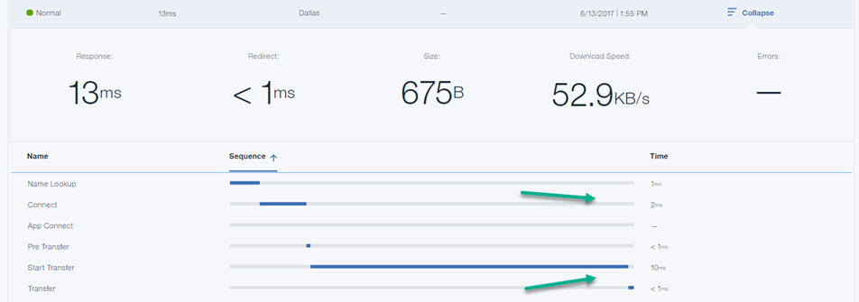
The connection and transfer times from Melbourne are longer than Dallas.  Remember the application is running in the US so it makes sense the connections times are longer from Melbourne.
8. Click on one of the locations to display response time for that location only, then click single points on the graph to display some detailed information.
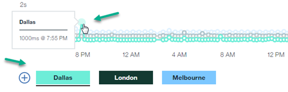
The screenshot was taken after the application has been running for some time.
9. Click **Metric Feed** to display more details.

0. Click **Metric Selection** to display the different locations that can be used for availability tests. Click on the plus sign to ther right of **Add more locations** to add and remove additional locations for response time monitoring.
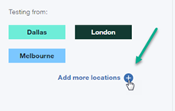
1. Scroll down to _Settings_.  Click on some more locations to add them to the list checking the application response time, then click **Finish**.
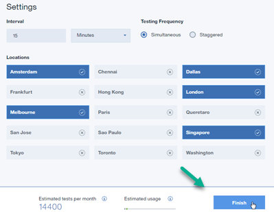
2. Now there are more locations ("test instances") testing the response time of your application.
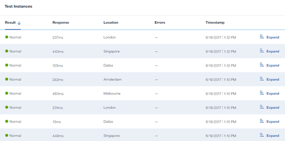
3. The Response Time display indicates the new locations as well by the additional colored circles.
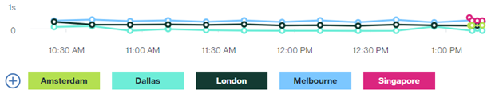
7. At the bottom of this page, you see the activity related to the monitored application in the last 24 hours.
   
8. Scroll back to the top of the page and click Edit from the pull down menu beside the appliction name in the Test Summary Section.
   
9. Here you can make changes to the API that is being monitored, the test name, frequency, locations , etc. Click on a location name to add it to the test, or click on a selected location to remove it. Notice the Notification Setup on the left side of the window. If you were using IBM Alert Notification Service, you could configure your notifications for these tests from here. You will add that to the toolchain in the next lab.
   
   
10. Click the 'X' at the top of this window to close it. Click the arrow at the top to return to the Availability Monitoring Summary page.
   
11. Click **Add a New Test**. Notice the different types of tests that you can add:
  - Response time and availability trends for this as well as dependent web pages and APIs
  - Availability of the app in different locations
  - Identify patterns by correlating performance with detailed alerts and development activity
  - Imitate real end-user behavior by monitoring synthetic scripts.
  
Click on each of the options to see how easily new tests can be added

Due to time constraints you won't add additional tests now. If you would like to explore Bluemix Availability Monitoring in more detail, visit the open labs area and check out Lab Number 9902. When you are finished viewing the monitoring information, return to your toolchain.
